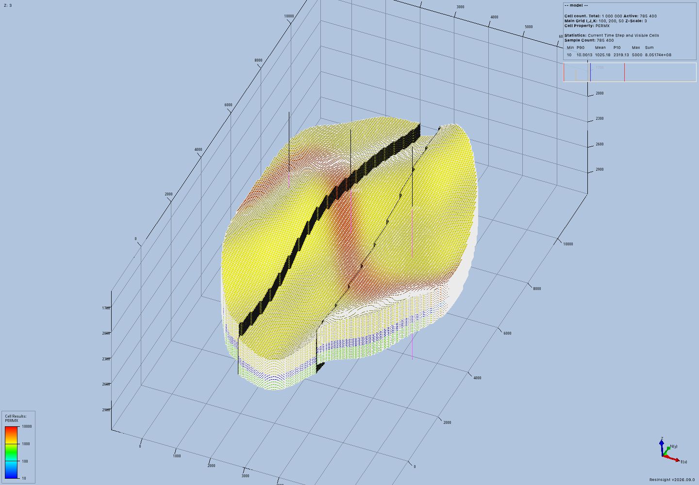
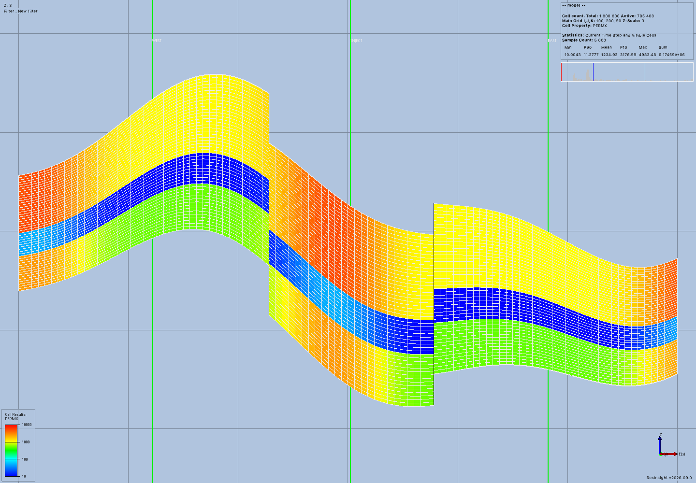

# General compilation evidence

This record covers public MCP creation, native ResInsight connections, OPM input validation, schedule revision, and receipt recovery.
The inputs are original synthetic data inspired by geological examples in the MRST gallery.
No MRST dataset, private reservoir data, or simulator results were copied.
This acceptance does not execute Flow.

## Recorded result

The model has 1,000,000 global cells and 785,400 active cells.
It includes two faults, folded layers, varying thickness, three rock bands, channel-shaped properties, and an inactive outer region.
Native checks verify a 150-meter fault displacement and agreement with authored cell corners.
Three independent wells each export 50 native connections.
The compiler preserves all 150 connections through OPM grid and schedule construction.

The explicit physics uses three spatial regions and 27 tables containing 57 rows.
The compiler compares 13,121,806 geometry and property values against their authored sources.
It also compares all regional map values and table assignments.
Four reports occur at 0, 0.5, 1, and 2 days in UTC.
Twelve control events cover producers, water injection, shutdown, reopening, and rate changes.

A child schedule changes the WEST producer's final rate from 200 to 350 sm3/day.
Its assembly reuses all three immutable native exports.
Both assemblies receive successful prepared receipts.
Both receipts remain identical after the MCP server and native application close and a fresh MCP server starts.
Each receipt explicitly reports `simulation_executed: false`.

The [summary](summary.json) records the exact tested implementation commit, package versions, counts, timings, and resource measurements.
The [acceptance log](acceptance.log) records every public tool call and its duration.
The [installation log](installation.log) records the installed package environment.
The [commit log](implementation-commit.log) records the normal repository checks.
The corrected implementation passed Ruff, ty, all 850 maintained tests, and the strict MkDocs build.
The [collection log](test-collection.log) records the exact test count.

The final run completed 115 public calls in 68.2 seconds.
Initial validation took 15.0 seconds and sampled 637.8 MiB of worker memory.
The revised schedule took 12.1 seconds and sampled 616.2 MiB.
Each preparation staged about 214.1 MiB of files.
Both used the default 1,024 MiB memory and disk budgets and the 120-second deadline.
Sampled MCP and native application memory remained separate measurements in the summary.

## Native images

These images were returned directly by public `geological_render` calls.
They show authored properties and native well paths, not simulated results.
The scene statistics report the million-cell grid and its active-cell count.



The section shows displaced layers, varying thickness, and the three named native paths.
Vertical exaggeration is three.



## Native centerline discrepancy

Two preliminary cases failed their independent expected-connection assertions before compiler preparation.
They used vertical paths through exact cell centers in the folded grid.
The coarse case omitted EAST cell `(8, 10, 6)`.
The million-cell case omitted WEST layers `1`, `6`, `19`, and `34` in column `(20, 100)`.
These are zero-based cell indices.

The successful run explicitly authors paths at cell fractions `(0.37, 0.43)` instead of `(0.5, 0.5)`.
It retains the same geological model parameters and expects every layer in each chosen column.
All 150 expected connections are present at these locations.
The MCP does not move paths automatically or fill missing native connections.
The compiler verifies preservation of native exports and cannot establish that ResInsight found every geometric intersection.

The native intersection source divides cell faces into triangles meeting at each face center.
Numerical handling at those shared triangle points is a possible cause, not an established root cause.
The centerline discrepancy remains an upstream investigation under issue #57.
The [coarse log](centerline-coarse.log), [million-cell log](centerline-million.log), and original protocol records preserve both failures.
Do not interpret the successful offset case as proof that every native well location works.

## Reproduction

The reviewed ResInsight build uses source commit `7c3635788a8b4f4fad5fcd92220ba88252d161b3`.
Its matching RIPS wheel reports version `2026.9.0.1` and includes the previously recorded grid-unit correction.
Package version alone does not identify that corrected build.
Use the [well evidence](../general-wells/README.md) for the build prerequisites.

Install the current package with its `imports` extra and the matching corrected RIPS wheel in a clean environment.
Run the [acceptance driver](acceptance.py) with that environment's Python:

```console
/absolute/path/environment/bin/python docs/development/evidence/general-compilation/acceptance.py \
  /absolute/path/new-output-directory --million \
  --source-commit TESTED_IMPLEMENTATION_COMMIT \
  --executable /absolute/path/ResInsight
```

The driver creates every input through public MCP tools.
It does not seed a workspace database or call internal application services.
It reuses the recorded public client and original fixture helpers from earlier evidence.
The final script contains the explicit offset path coordinates.
To investigate exact-center paths, replay their original target arguments from the archive.

## Archive and publication audit

The [protocol archive](protocol-records.tar.gz) contains original requests, structured responses, and native process logs.
The `million/` directory contains the successful run.
The `centerline-million/` and `centerline-coarse/` directories contain the failed geometry checks.
The [publication audit](publication-audit.json) records the parsed assertions and input provenance.
Workspace databases and full generated grid files are excluded.
The recorded authoring inputs and driver reproduce those files.

```console
mkdir -p /tmp/general-compilation-records
tar -xzf docs/development/evidence/general-compilation/protocol-records.tar.gz \
  -C /tmp/general-compilation-records
```

## Review and remaining work

Shared connection records keep native export readers independent from a running ResInsight process.
The existing schedule writer shares its control serialization with the general compiler.
Source identities remain authoritative, and compiled values receive independent OPM comparisons.
The public MCP test covers ownership, zero wells, and recovery after a process restart.
Library tests cover both unit systems, three regions, native export compatibility, worker limits, and an observed worker-exit race.

A repeated check found that process statistics can disappear before the operating system reports a worker's exit.
The corrected controller briefly waits for that owned child before deciding that its identity is unavailable.
A regression test reproduces this observation order while retaining a real OPM worker.
The [earlier failure log](worker-race-before-fix.log) preserves the finding.
The final commit checks passed after the correction.

General execution, numerical convergence, large result storage, and native simulation-result visualization remain separate work.
The supported input profile remains explicit and limited to the documented three-phase tables.
No total grid, well, connection, report, or table-row ceiling was added by this compiler.
