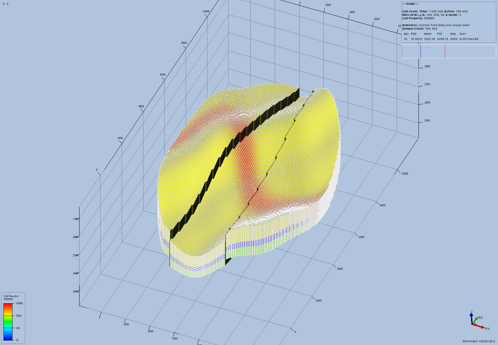
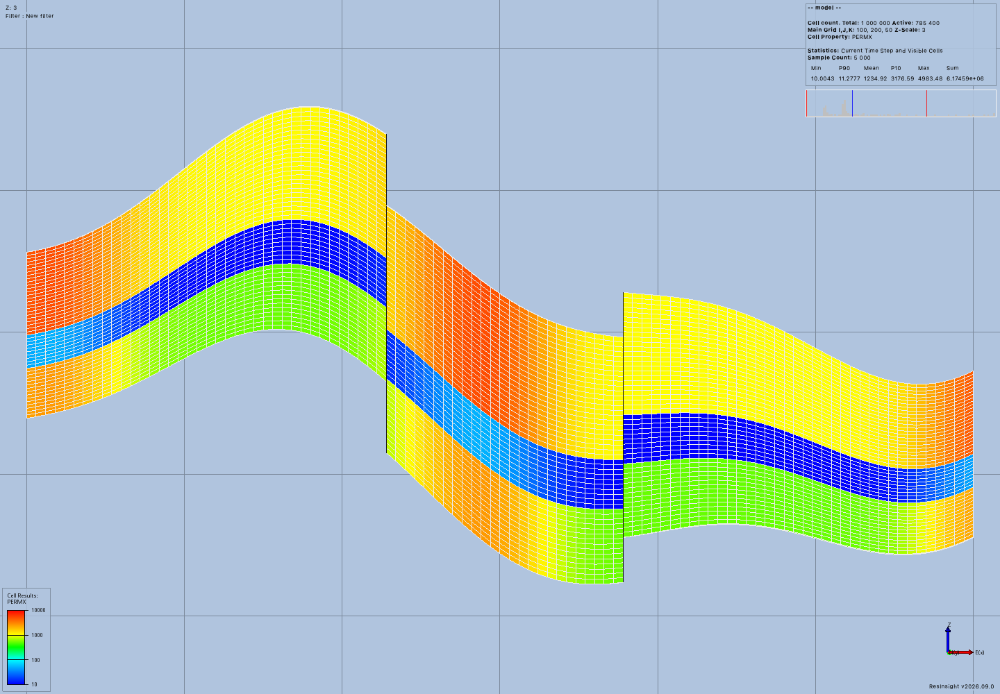
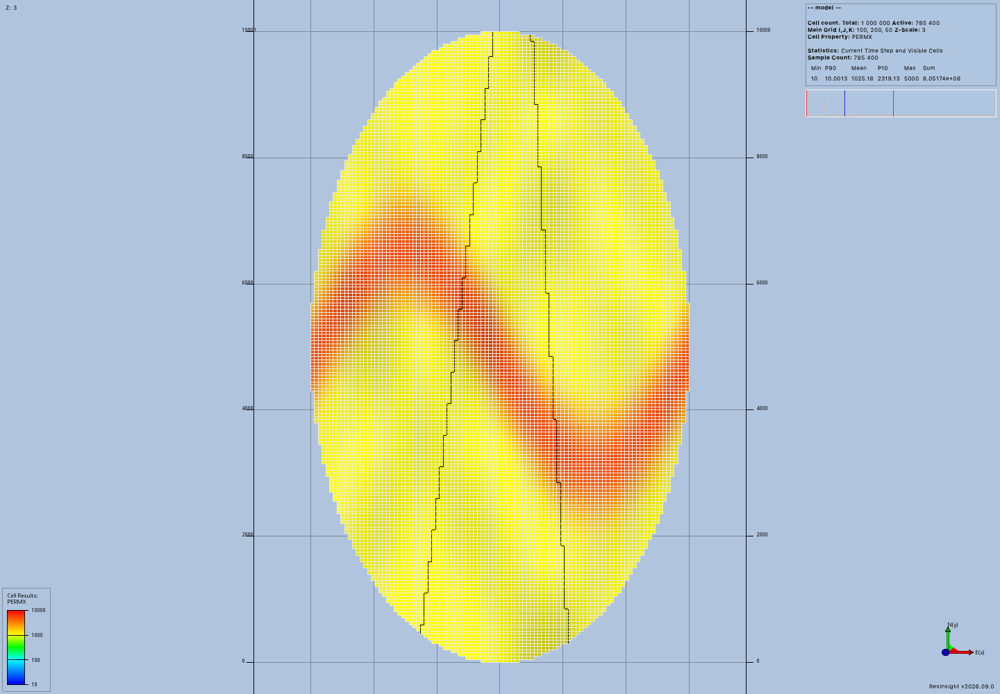
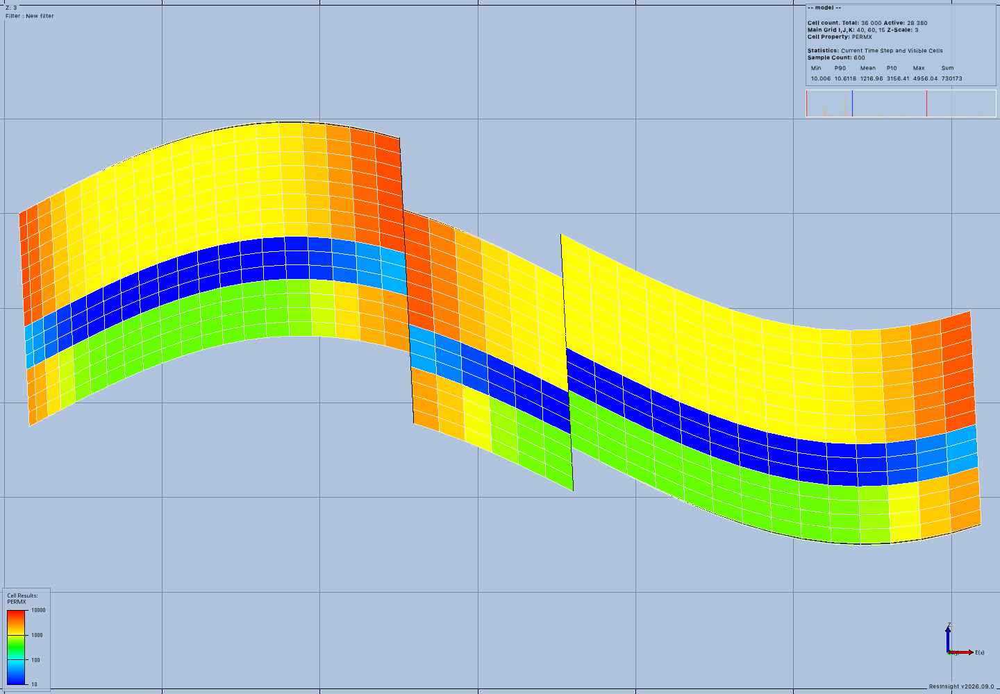

# Geological MCP acceptance

The public MCP launcher created and displayed a million-cell geological model in ResInsight on September 12, 2026.
A separate run used uploaded arrays to create nonuniform geometry with inclined pillars.
Both runs restored and numerically verified their models after restarting MCP and ResInsight.
The [approved plan](../../issue-57-plan.md) and [implementation record](../../general-model-authoring.md) define the remaining scope.

## Tested source and environment

The tested application source is commit `bdbeaccbc86f6c8ee2c12ae02a9204a933e1ee94`.
The acceptance scripts only call public MCP tools for engineering operations.
The explicit-input client constructs numeric arrays before uploading them through public tools.
Neither run seeds the workspace database or calls private model services.
Process inspection only records sampled memory use.

The runtime uses a noneditable installation at `/private/tmp/general-model-installed`.
The native executable is `/private/tmp/resinsight-p01-build/application-build/ResInsight.app/Contents/MacOS/ResInsight`.
It reports ResInsight `2026.09.0` in the exported images.
The native source checkout is `9c920334e338dab4908aa4dabdfae22803e70411`.
That checkout retains its existing `vcpkg.json` and `ThirdParty/openzgy` build changes.
The generated client comes from `/private/tmp/resinsight-well-rips-package/dist/rips-2026.9.0.1-py3-none-any.whl`.

The generated client includes the reviewed native camera controls.

| Component | Recorded value |
| --- | --- |
| Host | macOS 14.2.1, Apple arm64, 16 GiB physical memory, eight logical CPUs |
| Python | 3.12.13 |
| resinsight-mcp | 0.1.0 at the tested source commit |
| MCP SDK | 1.30.0 |
| RIPS | 2026.9.0.1, generated matching client |
| NumPy | 2.5.3 |
| Pydantic | 2.13.5 |
| grpcio / protobuf | 1.83.1 / 7.36.1 |

## Observed results

| Check | Generated geology | Explicit arrays |
| --- | --- | --- |
| Dimensions | 100 × 200 × 50 | 40 × 60 × 15 |
| Global cells | 1,000,000 | 36,000 |
| Active cells | 785,400 | 28,380 |
| MCP calls | 22 successful | 36 successful |
| Fresh native images | Three | Three |
| Geometry | Folded layers, two displaced faults, variable thickness | Nonuniform spacing, inclined pillars, folded and faulted layers |
| Properties | Three permeability bands, porosity, channel variation | Two uploaded rock fields with channel variation |
| Native load and property verification | 10.58 seconds | 0.67 seconds |
| Largest selected-corner error | 0.000115 meters | 0.000165 meters |
| Project reopening | Verified | Verified |
| MCP and application restart | Verified | Verified |

The generated model uses original parameters inspired by the [MRST gallery](https://www.sintef.no/projectweb/mrst/gallery/).
The [flexible gridding example](https://www.sintef.no/projectweb/mrst/gallery/flexible-gridding/) provides the geological complexity reference.
No gallery image or downloaded field model supplies the evidence.

Native verification checks every authored active property value against its stored input array.
The generated model has four authored fields and 785,400 active values per field.
The explicit model has two authored fields and 28,380 active values per field.
The service compares properties with relative tolerance `1e-6` and absolute tolerance `1e-8` in each field's declared unit.
The reported largest raw scalar difference is a diagnostic across fields, not a combined physical quantity.

Each geometry check samples three native cells, including both sides of the first fault and a bottom-layer cell.
The independent acceptance assertion confirms a 150-meter depth offset across that fault.
The explicit-array assertion also confirms horizontal movement down the inclined pillars.
Selected-corner checks use relative tolerance `1e-7` and absolute tolerance `1e-6` meters.
These samples do not prove every cell's corner geometry or establish a simulator quality assessment.

The generated model used about 355 MiB of sampled MCP server RSS and 1.45 GiB of sampled ResInsight RSS.
RSS measures resident process memory.
Sampling ran every 0.05 seconds and can miss short peaks.
These values exclude other processes and do not describe total GPU or system memory.
The retained million-cell workspace occupies 324,150,740 file-content bytes.
The observed generation call took 0.73 seconds on this host.

These measurements establish one working case, not a maximum supported size or a general performance guarantee.

## Native images

These PNG files came from `geological_render` as MCP image content.
The camera uses native display coordinates and threefold vertical exaggeration.
The reviewed native build centers this case in display coordinates.
The orthographic camera check permits movement along its viewing axis while preserving projected geometry and scale.
The receipt records the actual camera position.









The [explicit oblique view](explicit-oblique.png) and [explicit top view](explicit-map.png) provide the remaining frames.

## Reproduction and records

Create a fresh runtime and install the matching native client:

```bash
UV_PROJECT_ENVIRONMENT=/private/tmp/general-model-installed uv sync --locked --no-dev --extra resinsight --no-editable
uv pip install --python /private/tmp/general-model-installed/bin/python --reinstall /private/tmp/resinsight-well-rips-package/dist/rips-2026.9.0.1-py3-none-any.whl
```

The final source refresh used the command recorded in [install.log](install.log):

```bash
uv pip install --python /private/tmp/general-model-installed/bin/python --no-deps --reinstall .
```

Run each script with a new output directory:

```bash
/private/tmp/general-model-installed/bin/python docs/development/evidence/general-models/acceptance.py --output /private/tmp/general-mcp-proof-million --resinsight /private/tmp/resinsight-p01-build/application-build/ResInsight.app/Contents/MacOS/ResInsight
/private/tmp/general-model-installed/bin/python docs/development/evidence/general-models/explicit_acceptance.py --output /private/tmp/general-mcp-proof-explicit --resinsight /private/tmp/resinsight-p01-build/application-build/ResInsight.app/Contents/MacOS/ResInsight
```

The [generated run log](million.log), [explicit run log](explicit.log), and [metrics](metrics.json) summarize the final runs.
The [protocol archive](protocol-records.tar.gz) retains all 58 original call records, summaries, saved project files, and stderr logs.
Its `million/` and `explicit/` directories contain ordered `call-*.json` records.
Every archived call has a successful operation outcome, and every render has a successful observation outcome.
The archive was reopened and its parsed JSON outcomes were checked after creation.

```bash
mkdir /private/tmp/geological-protocol-records
tar -xzf docs/development/evidence/general-models/protocol-records.tar.gz -C /private/tmp/geological-protocol-records
```

The archive is protocol evidence and does not contain the complete generated workspaces.
The original workspaces remain in their output directories and retain the GRDECL files referenced by their saved ResInsight projects.
Replaying the scripts creates fresh workspaces and projects with new identifiers.

The [commit check](commit-check.log) records the successful required repository hook for the tested source.
The [shared check log](shared-check.log) records Ruff, formatting, typing, maintained tests, and the strict documentation build.
The command passed 791 maintained tests.
The [documentation screenshot](documentation.png) records the browser review of this evidence page.
The review found shared image capture and camera math reused across the existing and new native paths.
Array ownership, bounded reads, native value checks, and explicit failures have focused coverage.
General model operations remain synchronous, and some validation still allocates full numeric arrays within the configured estimate.

## Scope limits

This delivery creates geological inputs and verifies their native display.
It does not claim a completed Flow simulation, three-well acceptance, arbitrary simulator schedules, or support for every MRST mesh and solver.
Geometric fault displacement does not establish a sealing fault or another simulator flow condition.
The existing SPE1 and OPM workflow limits remain in their earlier paths.
Issue #57 remains open for general wells, schedules, physics, scalable results, and the remaining approved geometry adapters.
