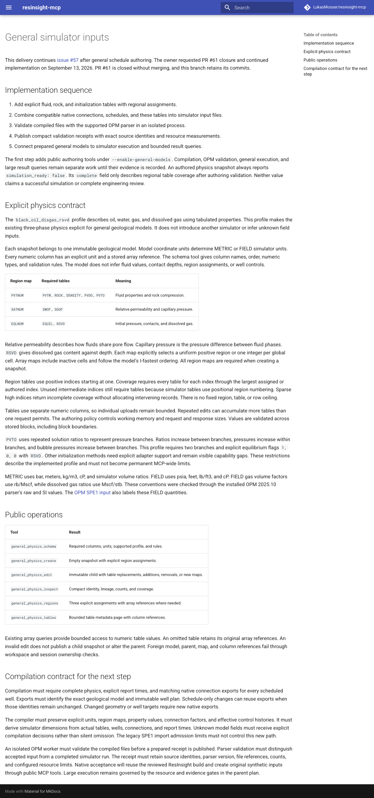

# Public MCP physics authoring evidence

The acceptance run tested implementation commit `1882a971bd2294e6e67c784b8f5fce38903a0077` on September 13, 2026.
The [delivery contract](../../general-simulator-inputs.md) describes the implemented profile and remaining simulator work.
The source branch retains the closed PR #61 schedule implementation without merging that PR.

## Observed result

An independent installed MCP client created original geological models and regional engineering inputs through public tools.
The METRIC model contains 1,000,000 active cells in a `100 × 200 × 50` grid.
Its geometry includes a fold, a displaced fault, and three permeability bands.
The FIELD model contains eight cells and uses explicit FIELD column units.
Neither fixture uses downloaded field data or hidden workspace setup.

The METRIC snapshot contains three regions for fluid properties, saturation properties, and initialization.
Its 27 tables contain 70,052 rows in total.
One gas-property table contains 70,001 rows, exceeding one array upload.
The FIELD snapshot contains nine tables with 18 rows.
Both snapshots have complete authored table coverage and report `simulation_ready: false`.

The client used a four-record edit budget and a two-record response budget.
Repeated edits accumulated complete regional snapshots beyond those per-call budgets.
Paged queries returned table metadata, and an array query verified the large table's final pressure values.
The parent snapshot retained its earlier table references and counts.
After MCP process restart, both child snapshots and the METRIC parent returned identical metadata.

Four requests failed as expected: an oversized edit, an oversized table page, a METRIC column using psia, and foreign workspace inspection.
The maintained tests separately exercise malformed values, regional maps, memory admission, immutable edits, units, and ownership.
The implementation commit passed the normal pre-commit hook, which runs the shared repository command.
The [shared check log](shared-check.log) records Ruff, ty, the maintained tests, and the strict documentation build.

| Measurement | Observed value |
| --- | --- |
| Public tool calls | 163. |
| Expected rejections | 4. |
| End-to-end elapsed time | 13.80 seconds. |
| Peak sampled MCP process memory | 359.75 MiB. |
| Stored workspace files | 109.89 MiB. |
| Largest structured tool response | 4,880 characters. |
| MCP process restart | Verified. |
| Native ResInsight launch in this run | Not performed. |
| OPM input validation in this run | Not performed. |
| Simulator execution in this run | Not performed. |

Process memory was sampled every 50 milliseconds and can miss short peaks.
Response measurements exclude tool discovery and count structured JSON rather than full transport framing.
Call timing includes sampler shutdown, so individual timings have roughly 50-millisecond resolution.
These measurements establish authoring behavior on this host, not universal capacity or simulator readiness.

The run used Python 3.12.13, MCP 1.30.0, NumPy 2.5.3, and Pydantic 2.13.5 on macOS 14.2.1 arm64.
The installed package used only declared runtime dependencies, without ResInsight or OPM extras.
Earlier [geological evidence](../general-models/README.md) and [well evidence](../general-wells/README.md) establish separate native behavior.
This run does not replace those native checks or complete issue #57.

## Reproduction and original records

Run these commands from the tested source checkout with a new output directory:

```sh
uv venv /private/tmp/general-physics-installed
uv pip install --python /private/tmp/general-physics-installed/bin/python .
/private/tmp/general-physics-installed/bin/python \
  docs/development/evidence/general-physics/acceptance.py \
  /private/tmp/general-physics-acceptance \
  --source-commit 1882a971bd2294e6e67c784b8f5fce38903a0077
```

The [driver](acceptance.py) contains every original synthetic fixture input and assertion.
The [summary](summary.json) records exact model and snapshot identities, versions, counts, and measurements.
The [call log](acceptance.log), [installation log](installation.log), and [commit log](implementation-commit.log) preserve their command outcomes.

The [protocol archive](protocol-records.tar.gz) contains 166 original files.
Its flat member paths include `call-0001-*.json` through `call-0163-*.json`, `policy.json`, `tools.json`, and `mcp-stderr.log`.
Each call record contains the public request, structured response, error flag, and measured duration.
Extract these records with this command:

```sh
mkdir physics-records
tar -xzf protocol-records.tar.gz -C physics-records
```

The [publication audit](publication-audit.json) records parsed archive membership and synthetic input provenance.
The archive excludes workspace databases and stored numeric files.
It contains no acquired field data, user datasets, credentials, or captured environment values.

## Review

Table schemas define column names, units, types, and region ownership in one model module.
The service owns immutable snapshots, while block validation owns numeric rules.
MCP operations and managed routing delegate to this service without importing native or simulator libraries.
Separate column arrays avoid placing complete numeric tables inside responses or snapshot manifests.

Tests cover public behavior and important failures, including validation across array-block boundaries.
Table metadata still grows with the number of tables, subject to the configured memory estimate.
Future compiler work must preserve that explicit policy and must validate complete files before publishing prepared receipts.

The strict documentation build passed, and the rendered delivery page was inspected.
Its layout showed readable tables and complete text without clipping.
The browser reported a missing GitHub latest-release endpoint, which did not affect the local documentation.


