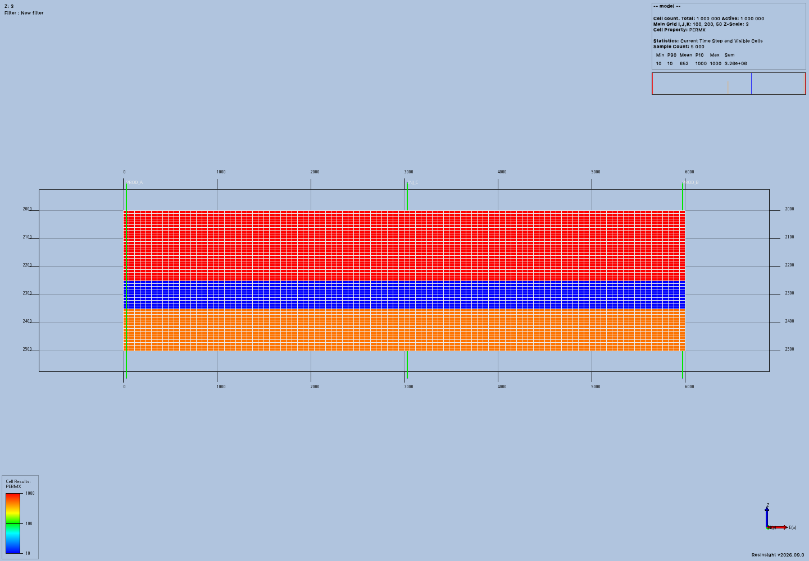
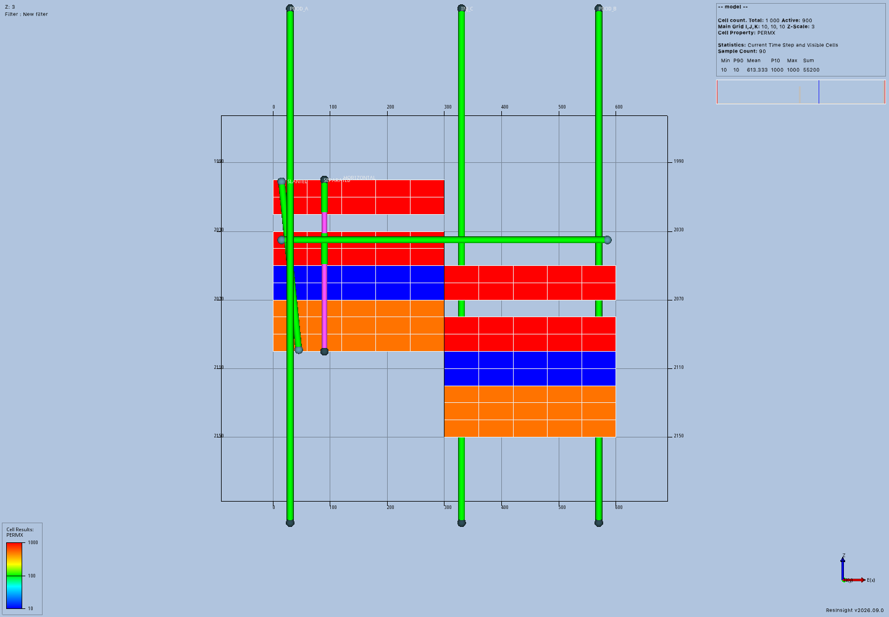

# General well acceptance

This record covers the well delivery under [issue #57](https://github.com/LukasMosser/resinsight-mcp/issues/57).
It extends the [geological acceptance](../general-models/README.md) with native wells and immutable connection exports.
It does not establish simulator schedule or Flow support for general models.

The tested MCP implementation is `7f8c10f1e03c5f580310429b390865ab653e645b`.
The final million-cell run used that committed source and native commit `7c3635788a8b4f4fad5fcd92220ba88252d161b3`.
The [shared command log](shared-check.log) records 805 passing tests, Ruff, typing, and strict documentation checks.
The [native test log](native-tests.log) records two passing unit and intersection tests.
The [version record](versions.json) identifies the native build and installed packages.

## Observed behavior

A public MCP client created an all-active 100 by 200 by 50 model.
The three permeability bands contain 1,000 mD, 10 mD, and 500 mD.
Porosity is explicitly 0.20, 0.15, and 0.25 in those bands.
Cells measure 60 by 50 by 10 model length units.
Depth starts at 2,000 units in an original local, positive-down coordinate frame.

The meter-based target has two corner producers and one central water injector.
Their zero-based `(i, j)` addresses are `(0, 0)`, `(99, 199)`, and `(50, 100)`.
Each path passes through cell centers and extends 100 meters beyond both ends of the reservoir.
Each well returns exactly 50 active-cell connections.
The client checks the complete cell sets, permeability-length products, diameters, and directions.

Small runs prove vertical, horizontal, slanted, and separated-interval wells in meters and feet.
A faulted fixture offsets half the grid by 50 meters and removes the third layer from the active cells.
Its three vertical wells each return nine connections, with the inactive layer absent.
Its horizontal path returns five cells before the fault offset places the remaining path above the reservoir.
A separate dense fixture exercises 121 targets and 120 perforation intervals through multipart arrays.
It returns ten aggregated cell connections and retains the separated source intervals.

Each completed run saves and reopens the ResInsight project.
It then exits MCP and the owned application and starts both again.
The client restores grid and well receipts against current native references.
It re-exports all connections and compares every stored column before and after each recovery.
Native screenshots come from MCP image responses.



The section displays one J row of the million-cell model.
Numerical exports establish each well's complete 50-cell connection set.
The full native grid appears in the [oblique view](million-01.png).



The inactive layer appears as an empty band on both sides of the fault.
The horizontal path remains visible above the deeper fault block, where it has no reservoir connections.
The [FIELD section](feet-02.png) and [dense-path section](dense-02.png) show the other acceptance fixtures.

## Measurements

The four successful general runs contain 1,088 recorded public MCP calls and eight native images.
All cases passed project reopen and complete MCP/application restart checks.
The largest structured response contains 3,802 characters.
These figures exclude image payloads and describe this acceptance, rather than permanent product limits.

| Fixture | Global cells | Native wells | Connections | Peak MCP MiB | Peak ResInsight MiB |
| --- | ---: | ---: | --- | ---: | ---: |
| Million-cell target | 1,000,000 | 3 | 50 per well | 374.6 | 1,405.4 |
| FIELD geometry | 1,000 | 6 | 10 per continuous path, 4 for separated intervals | 105.7 | 330.8 |
| Fault and inactive layer | 1,000 | 6 | 9 per vertical/slanted path, 5 horizontal, 4 separated | 99.9 | 304.6 |
| Dense multipart path | 1,000 | 7 | 10 for the 121-target path | 111.9 | 329.4 |

Memory values are sampled resident process memory, rather than guaranteed upper bounds.
The [metrics record](metrics.json) includes all operation times, response sizes, and workspace storage.
The final million-cell workspace occupies about 168.3 MiB.

## Existing workflow regression

The existing bounded OPM workflow passed 854 automated checks across 353 public tool calls.
It produced two accepted simulation results and verified project and MCP recovery.
The archived `legacy/acceptance.json` preserves its original `acceptance_complete: false` because its separate full image review remains pending.
This record treats that run as an automated regression check, without declaring a new complete P13 acceptance.
Its owned ResInsight processes stopped, and its stopped job containers remain available for inspection.

## Numerical reference

The target wells cross complete vertical cells in an isotropic rectangular grid.
Their permeability-length product equals layer permeability times cell height.
The reference connection factor uses the standard rectangular-cell well-radius expression used by ResInsight.
For these fixtures, the effective radius is `0.14 * hypot(60, 50)` and the well radius is `0.1`.
The reference factor is `2*pi*darcy*kh/log(effective_radius/well_radius)`.
The native source defines `darcy` as `0.008527` for METRIC and `0.001127` for FIELD.

The client uses relative tolerance `1e-6` and absolute tolerance `1e-6` for these reference values.
Recovery comparisons use relative tolerance `1e-7` and absolute tolerance `1e-6`.
These tolerances allow native floating-point conversions while exposing wrong units and changed connection values.
Measured-depth endpoint validation allows relative tolerance `1e-6` because native samples use finite precision.

## Native unit correction

The first FIELD run exposed a native ASCII import defect.
The file declared `GRIDUNIT FEET`, but the loaded case retained METRIC units.
Its connection factors exceeded the FIELD reference by the ratio `0.008527/0.001127`.
The failed original records remain part of the evidence archive.

The [native patch](native-grid-units.patch) preserves declared grid units and adds `case.grid_unit_system()`.
The MCP checks the actual native unit system before well creation, restoration, and export.
An unavailable query or unit mismatch produces a typed failure before well mutation.
The corrected FIELD run passes the numerical reference and both recovery checks.
The native input-loading test covers METRES, FEET, CM, and an invalid declaration.

The native base is `9c920334e338dab4908aa4dabdfae22803e70411`.
The corrected local build uses the native unit-fix commit recorded in `versions.json`.
The generated RIPS package has version `2026.9.0.1` and includes the new unit query.
The version number alone does not identify the required generated client.
The preexisting native `vcpkg.json` and `ThirdParty/openzgy` build changes remain unchanged.

## Reproduction

Use the corrected native source and its matching generated RIPS wheel.
Install the MCP implementation from this delivery into a separate environment.
All fixture inputs are created through public MCP tools.
The client uses NumPy only to construct and compare explicit input and output values.
It does not write the workspace database or call private model services.

```console
python well_acceptance.py /absolute/output/million --million
python well_acceptance.py /absolute/output/feet --unit ft
python well_acceptance.py /absolute/output/faulted --inactive
python well_acceptance.py /absolute/output/dense --dense
```

Run these commands with `docs/development/evidence/general-wells` as the working directory.
The script requires a new output directory for each run.
The recorded executable path identifies the reviewed local ResInsight build.
The shared recorder in `../general-models/acceptance.py` logs original MCP calls and samples process memory every 50 milliseconds.

Apply `native-grid-units.patch` after the recorded native base.
Build ResInsight with the existing reviewed configuration before generating its RIPS package.
The build creates `GrpcInterface/Python/rips/generated/generated_classes.py` with the new unit query.

```console
uv build --wheel /absolute/native-source/GrpcInterface/Python --out-dir /absolute/rips-wheel
uv pip install --python /absolute/environment/bin/python --no-deps --reinstall /absolute/rips-wheel/rips-2026.9.0.1-py3-none-any.whl
```

The [native build log](native-build.log) records successful compilation and client generation.

## Original records

`protocol-records.tar.gz` contains 1,960 files under `million/`, `feet/`, `faulted-inactive/`, `dense/`, `failed-feet/`, and `legacy/`.
The general groups preserve every original `call-*-<tool>.json`, native image, saved project, summary, and driver log.
The failed FIELD group preserves the incorrect native factor result and its rejecting assertion.
The legacy group preserves its original calls, checks, result records, native images, and cleanup records.
The archive membership and every JSON document were checked after packaging.

```console
mkdir extracted-evidence
tar -xzf protocol-records.tar.gz -C extracted-evidence
```

Complete workspace databases and array directories remain at the original paths in the records.
They are omitted from the archive because the public calls and fixture script reproduce their inputs.
The [rendered documentation](documentation.png) was inspected after a strict MkDocs build.

## Limits and review

The default authoring working-memory estimate is 512 MiB.
Native RPC and launch deadlines are 30 and 120 seconds.
These settings do not impose a fixed well, target, interval, or cell count.
Native trajectory and completion RPC responses remain whole tables inside the process.
MCP responses contain array descriptions and bounded ranges.
Native creation remains synchronous, and long operations still hold the managed workspace selection lock.

ResInsight combines separated intervals within one cell.
The exported depth bounds can span a gap and do not declare that gap perforated.
Well plans preserve the original intervals independently.
Paths exactly on shared cell boundaries depend on native intersection behavior and can produce no connections.
The acceptance paths deliberately cross cell interiors.

The shared native adapter serves both the existing FIELD workflow and the new general path.
The legacy adapter preserves its existing request and response records.
The general path owns well plans, native receipts, unit checks, and compact array exports.
Focused tests cover immutable history, workspace isolation, stale references, invalid cells, interval bounds, and uncertain native mutation outcomes.
Branches, native path updates, arbitrary schedules, and general Flow preparation remain unfinished work under issue #57.
