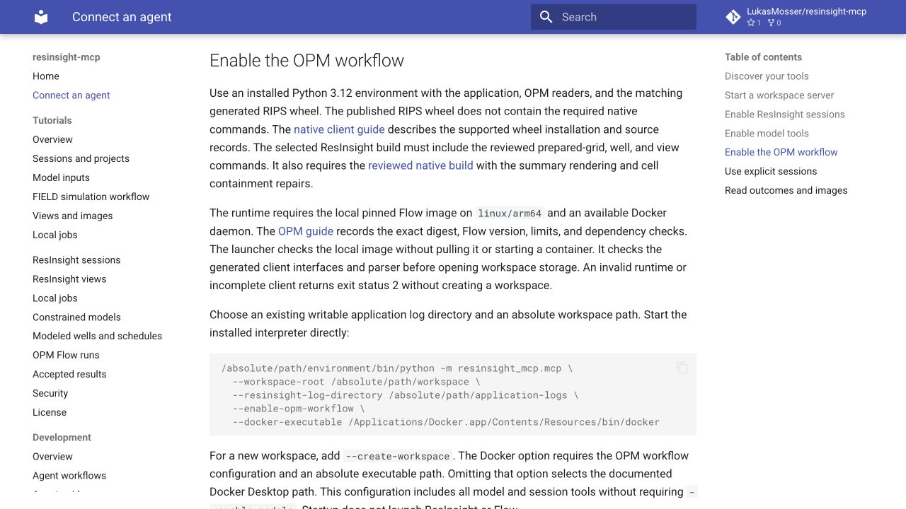
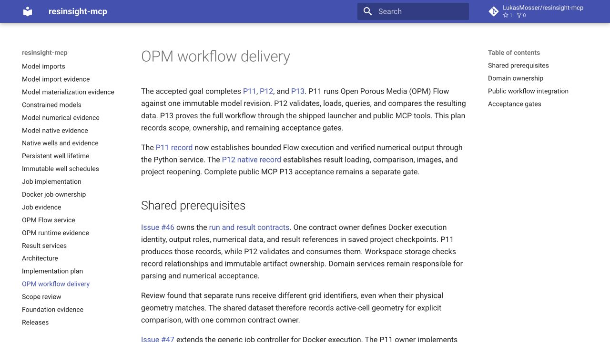

# Final MCP integration checks

The reviewed MCP branch contains only its own changes after P11, P12, and persistent well lifecycle integration.
The [shared command](shared-check.log) passes 666 maintained tests, Ruff, ty, and strict documentation checks.
The [environment](environment.json) records the exact source and the two documentation edits present during that check.

The final application source matches installed source `b4c414beee91a0fa419f04e7c7874d2b2108a5a7`.
The recorded Git comparison has no application source differences.
The [P12 installation record](../../p12/native/trial-07/installation.json) identifies that ordinary wheel and its matching native build.
Complete public workflow evidence belongs to the separate P13 delivery.

The [browser review](browser-review.json) covers the final native requirements and current P12 delivery status.
The lead inspected both original screenshots before closing the temporary tab and local server.

