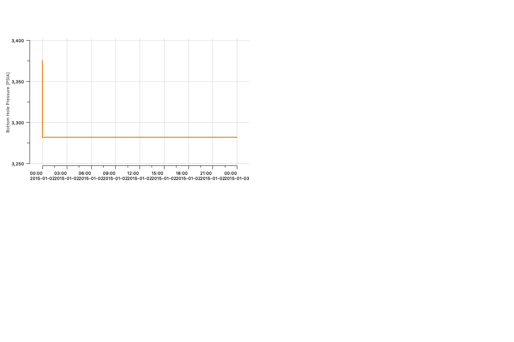
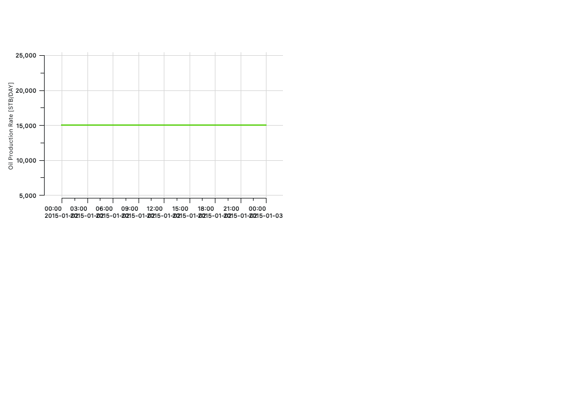
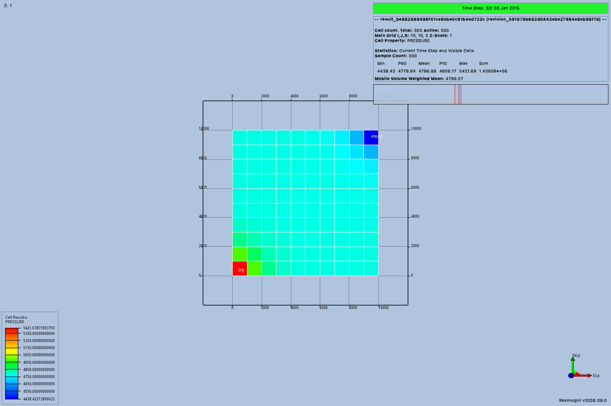
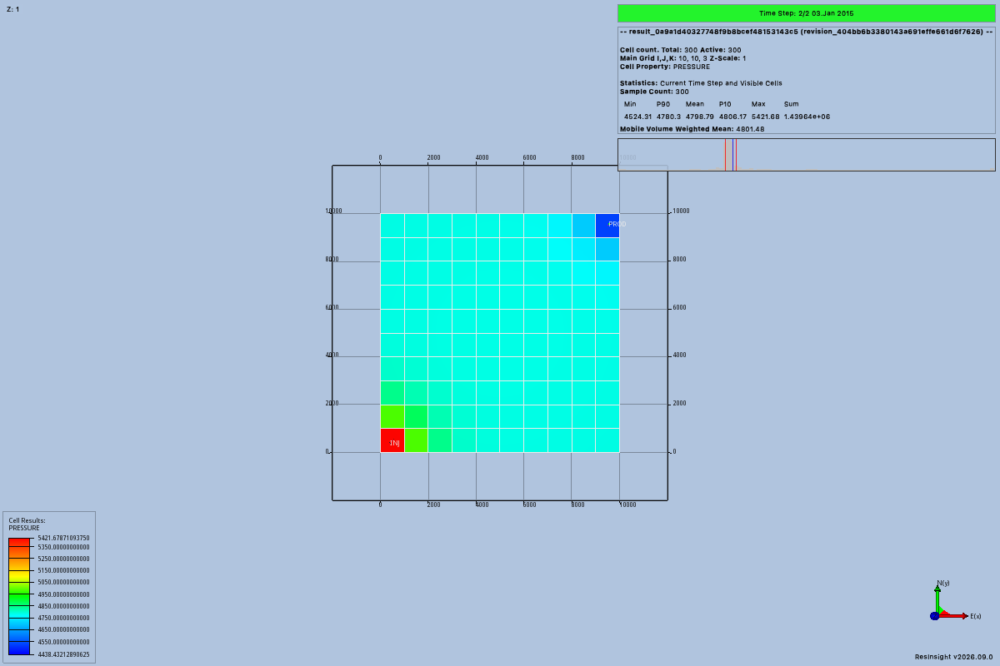
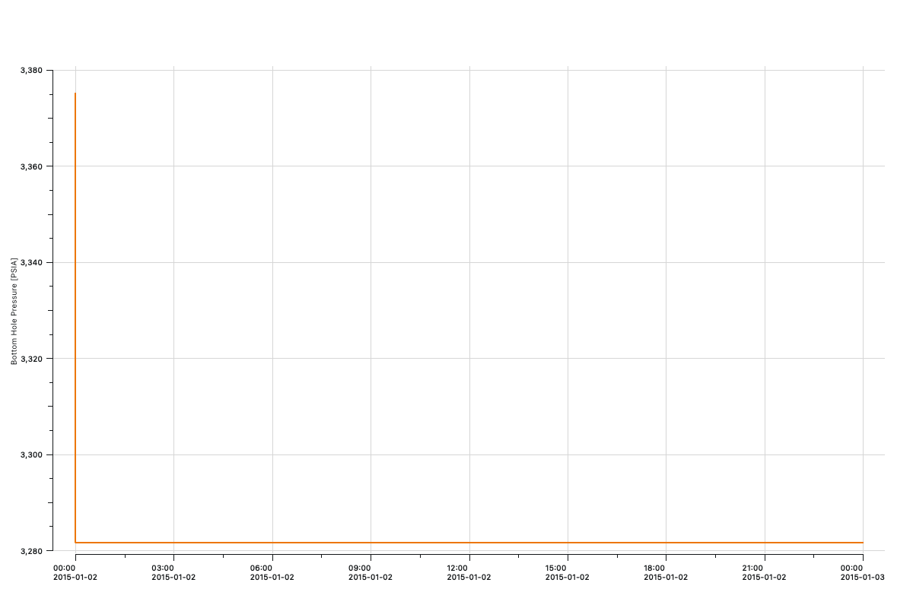
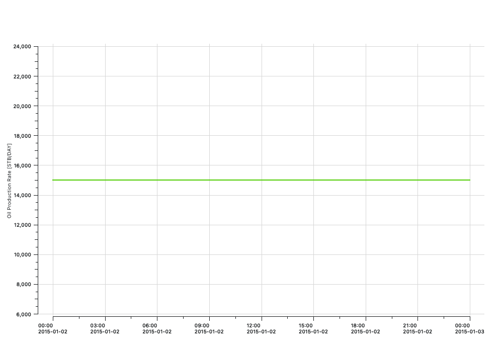
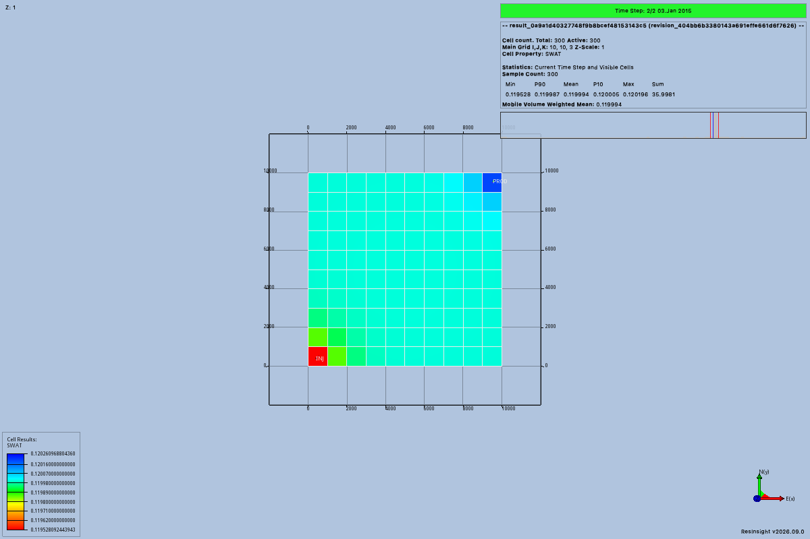
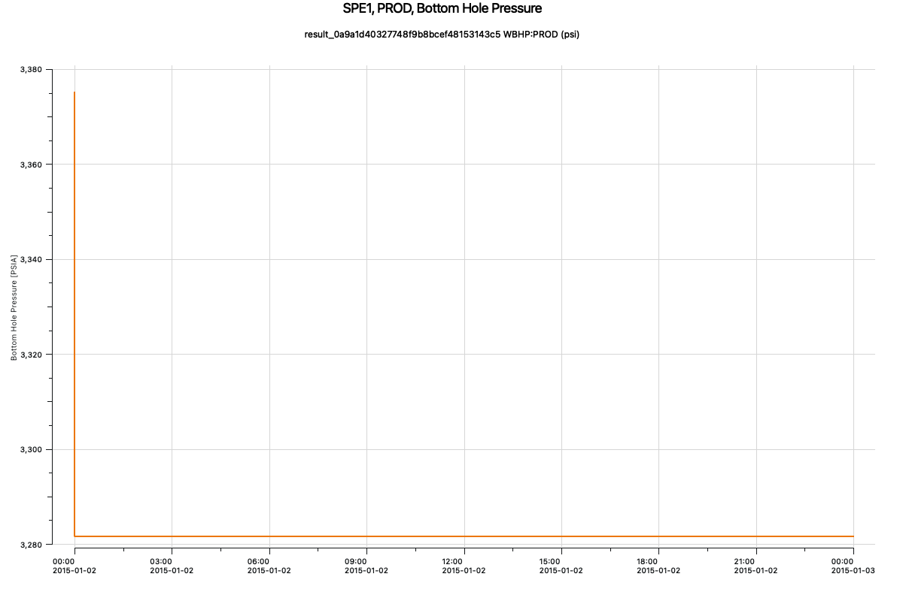
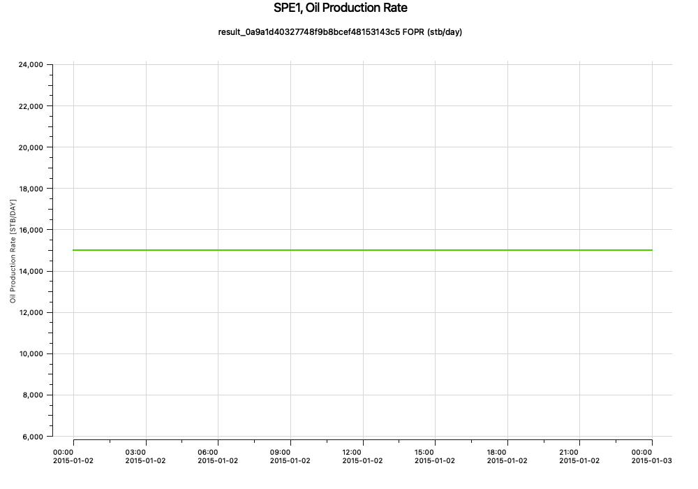

# P12 native trials

Trial 07 establishes P12 native acceptance on the recorded macOS build.
The [lead review](trial-07/lead-review.json) confirms numerical, visual, reopened-project, and owned-process checks.
The probe records automated completion separately from this later review.

## Native rendering build

Trial 07 uses native source `9c920334e338dab4908aa4dabdfae22803e70411` and its matching generated RIPS client.
The [complete native patch](native-render-04/native-change.patch) preserves the changes from `551dc02e19a1eb75ae462a0313f7a9a3101c2f45`.
These repairs are required for the reviewed summary image export workflow.
The upstream `2026.9` version alone does not identify these changes.

The [first build command](native-render-01/build-command.json) and [first build log](native-render-01/build.log) preserve the initial renderer repair.
The [second build command](native-render-02/build-command.json) and [second build log](native-render-02/build.log) preserve the title visibility and label painter repair.
Both earlier build records report exit code zero.
The [final build command](native-render-04/build-command.json) and [final build log](native-render-04/build.log) record the completed title repair.
The [repair 02 installation](native-render-02/repair-02-installation.json) records the earlier application wheel.
The [repair 03 installation](native-render-02/repair-03-installation.json) records application source `b4c414beee91a0fa419f04e7c7874d2b2108a5a7` with the selected one-cell plot layout.
This record describes local acceptance provenance and does not provide a released native distribution.

## Trial 01

Trial 01 failed during the first native result load.
It did not reach native numerical readback, image capture, or project reopening.
This trial does not establish P12 native acceptance.

The [command](trial-01/command.json) uses the reviewed installed interpreter and two generated P11 results.
The [installation record](trial-01/installation.json) identifies application source `38e5aa8d9eca0c81e72ffdbdddfcf561e8735cbe` and its matching generated RIPS client.
The [environment](trial-01/environment.json) records native source `551dc02e19a1eb75ae462a0313f7a9a3101c2f45` and the probe checkout.
The [probe copy](trial-01/probe-used.txt) preserves the exact trial code.
The probe checkout differs from the installed application source.

The production service accepted both immutable output bundles before native launch.
The [baseline bundle](trial-01/baseline-bundle.json) and [scenario bundle](trial-01/scenario-bundle.json) preserve their complete result identities.
The [baseline dataset](trial-01/baseline-dataset.json) and [scenario dataset](trial-01/scenario-dataset.json) preserve their accepted source values and geometry.

The first `ResultsService.load` returned `execution_failed` with mutation effect `unknown`.
Its message was `ResInsight call failed: No result returned from Method`.
The [client error](trial-01/client-stderr.log) preserves the captured command output.
The [failure record](trial-01/failure.json) identifies the failed stage and missing image evidence.
Intermediate native inventory was not captured, so this trial does not identify the failed call within native loading.
The [native log](trial-01/native-logs/c63c35b5c8f2483caaebd7d642a202a0.log) contains no more specific import failure.

Source inspection supports a duplicate summary import explanation.
`RicfLoadCase` uses the normal reader settings from `RiaPreferencesGrid`, which enable companion summary import.
`RimSummaryCaseMainCollection::createSummaryCasesFromFileInfos` skips an existing summary filename.
`RimProject_importSummaryCase::execute` then returns no object when it creates no new case.
This explanation does not replace intermediate runtime observations.

The [connection](trial-01/connection.json) records owned process `68680` with start marker `1788977632.649255`.
The [public close receipt](trial-01/close.json) confirms owned termination after failure.
The [independent process check](trial-01/cleanup-verification.json) confirms that the process identifier was absent afterward.
The native lane was released only after these checks.

## Trial 02

Trial 02 used the [rebuilt application wheel](trial-02/installation.json) from source `917dd33a836aa0349d3620cf9e1d02cb8fb0a122`.
The [command](trial-02/command.json) retained the same generated models and native application build.
Both production result loads and the following rebind succeeded.
The recorder then failed while serializing native observations, before writing its first native readback file.
The [client error](trial-02/client-stderr.log) reports `RepeatedScalarContainer` as unsupported JSON input.
The [exact probe](trial-02/probe-used.txt) identifies the completed service calls before that recorder failure.
This attempt produced no images and did not complete P12 native acceptance.

The [public close receipt](trial-02/close.json) confirms termination of the owned process after failure.
The [independent process check](trial-02/cleanup-verification.json) confirms that process `80450` was absent afterward.
The recorder repair converts supported repeated scalar sequences to ordinary lists at their native read boundaries.
It preserves all values and existing comparisons.

## Trial 03

The [third command](trial-03/command.json) used application source `917dd33a836aa0349d3620cf9e1d02cb8fb0a122` and corrected probe source `a31748d9a385ffe88e3f4b1dc163eec11a1b48cf`.
The installed application, generated RIPS client, native build, and two generated results stayed unchanged from trial 02.
The [installation record](trial-03/installation.json), [environment](trial-03/environment.json), and [exact probe](trial-03/probe-used.txt) preserve that provenance.
The command exited successfully and completed every programmed numerical and project check.

The [numerical review](trial-03/numerical-review.json) records four complete native readbacks before and after project reopening.
Each readback contains 300 active cells on a `10 × 10 × 3` grid.
Each checks 7,200 corner coordinates, six property arrays containing 1,800 values, and three summary curves containing six report values.
All source and native corner, property, and summary differences are exactly zero.
The properties are `PRESSURE`, `SWAT`, and `SGAS` at two report times.
The curves are `FOPR`, `WBHP:PROD`, and `WBHP:INJ`.

The native grid includes its initial report on January 1, 2015.
The accepted reports are January 2 and January 3, at elapsed days 1 and 2.

The [baseline native record](trial-03/baseline-native.json) and [scenario native record](trial-03/scenario-native.json) retain every observed value and corner.
The [restored baseline record](trial-03/baseline-restored-native.json) and [restored scenario record](trial-03/scenario-restored-native.json) repeat those checks after reopening.
The [baseline source files](source-bundles/baseline/manifest.json) and [scenario source files](source-bundles/scenario/manifest.json) accompany their manifests.
Each source folder contains the five unchanged files used by the trial.
P11 supplies verified source units, since the pinned native API has no separate unit getter.
These comparisons establish faithful native readback, not an independent simulator physics reference.

The [pressure comparison](trial-03/pressure-comparison.json) ranges from `0` to `87.21044921875 psi` for scenario minus baseline.
The [water saturation comparison](trial-03/swat-comparison.json) ranges from `-0.00006521493196487427` to `0`.
The [producer pressure comparison](trial-03/well-comparison.json) ranges from `470.05029296875` to `498.1962890625 psi`.
Both images in each grid pair have identical native legends and cameras.
Native water saturation legend endpoints retain the existing `1e-14` relative tolerance against requested endpoints.

The [checkpoint](trial-03/checkpoint.json) contains both result identifiers.
The probe saved the native project, removed its local copy, and restored the same path from the immutable project artifact.
It reopened that project and rejected the [old reference](trial-03/stale-reference.json).
The [fresh bindings](trial-03/restored.json) retain both exact results and their new application context.
The [saved project](trial-03/results.rsp) preserves the resulting native configuration.

The [image review](trial-03/visual-review.json) covers all five original PNGs at `1200 × 800` pixels.
All four grid images show the grid, well labels, result identity, requested quantity, and final report date.
Their pressure units remain in the observation metadata and are not visible in the native legends.
The summary PNG has a white left strip and a mostly transparent region that displays as black.
It has no readable curve, title, or axes, so complete native acceptance remains false.
The [applied plot receipt](trial-03/well-plot-edit.json), [observation](trial-03/well-plot.json), and [provenance](trial-03/well-plot-provenance.json) preserve this failed visual result.

The saved project shows child summary plot identifier `-1` inside parent `MultiPlot` identifier `3`.
The native exporter treats `-1` as every docked plot.
The targeting repair resolves the supported `plot.ancestor(rips.MultiPlot)` and requires a nonnegative identifier before export.
This targets one plot window without claiming that it fixes the rendering defect.

The [public close receipt](trial-03/close.json) confirms owned termination.
The [independent process check](trial-03/cleanup-verification.json) confirms that process `84243` was absent afterward.
The native lane was released before evidence review.
The [review script](trial-03/review-used.txt) and [review log](trial-03/review.log) preserve the checks applied to saved records.

## Trial 04

Trial 04 used [application source `527d402`](trial-04/installation.json), native source `70399abb`, and probe source `b7c0ccc`.
The [exact command](trial-04/command.json) records their full identifiers and the unchanged generated results.
The native repair uses the existing plot page renderer for PNG output.
The [native patch](native-render-01/native-change.patch), [build command](native-render-01/build-command.json), and [build log](native-render-01/build.log) preserve that change.
The installation record also records compiler, CMake, and matching generated client provenance.

The [automated completion record](trial-04/completed.json) reports success and leaves visual acceptance pending.
The [numerical review](trial-04/numerical-review.json) again finds zero source/native corner, property, and summary differences before and after reopening.
All four grid images retain matching legends, cameras, result identifiers, quantities, and final report dates.
The [saved project](trial-04/results.rsp) contains both requested plots and both results.
The [review script](trial-04/review-used.txt) and [log](trial-04/review.log) retain the saved-record checks.

The [well request](trial-04/well-plot-request.json) creates scenario `WBHP:PROD` at `1200 × 800` pixels.
The [field request](trial-04/field-plot-request.json) creates scenario `FOPR` at `1000 × 700` pixels using a fresh project context.
The [first inventory](trial-04/plots-before-field.json) contains the well plot under parent window `3`.
The [second inventory](trial-04/plots-after-field.json) preserves that plot and adds the field plot under parent window `4`.
The second export succeeds while the first plot remains present.
Both [well](trial-04/well-plot-edit.json) and [field](trial-04/field-plot-edit.json) edit receipts retain their exact numerical curves.

The [visual review](trial-04/visual-review.json) inspected all six original PNGs.
Both summary images now contain readable curves and axes with units.
Neither image shows its configured result title, their date labels overlap, and each graph occupies only the upper-left canvas region.
These remaining presentation defects prevent a complete visual acceptance claim.
The [title metadata review](trial-04/title-metadata-review.json) confirms that both child descriptions and all saved title visibility flags are present.
The original images are preserved below.

The [public close receipt](trial-04/close.json) confirms owned termination.
The [independent process check](trial-04/cleanup-verification.json) confirms that process `99165` was absent afterward.
The native lane was released before further investigation.

## Trial 05

Trial 05 used [application source `b4c414b`](trial-05/installation.json), native source `cd6450ab`, and probe source `b9e90a4`.
The [exact command](trial-05/command.json) records their complete identifiers.
The application sets the selected plot parent to one column and one row before export.
The reviewed native patch preserves the complete plot page and correct date label scaling.

A recorder preflight attempt created the output directory before the probe required that directory to be new.
The [preflight error](trial-05/preflight-client-stderr.log) occurred before native launch.
The recorder preserved its logs, removed that empty directory, and ran the unchanged command successfully.
This preflight error does not indicate a product failure.

The [completion record](trial-05/completed.json) confirms automated success and leaves visual acceptance pending.
The [numerical review](trial-05/numerical-review.json) verifies all four native records with exactly zero geometry, property, and summary differences.
The [saved project](trial-05/results.rsp) reopens with both exact result identities.
The [first plot inventory](trial-05/plots-before-field.json) and [second plot inventory](trial-05/plots-after-field.json) preserve parent `3` while adding parent `4`.
The [review script](trial-05/review-used.txt) preserves these saved-record checks.

The [visual review](trial-05/visual-review.json) inspects all six original PNGs.
Both summary graphs now fill their single-cell pages with readable dates, units, and curves.
The well image measures `1200 × 800` pixels, and the field image measures `1000 × 700` pixels.
Both images still omit the configured result title, so complete visual acceptance remains pending.
All four grid images retain their intended property, result, report, matching legend, and camera.

The [public close receipt](trial-05/close.json) confirms owned termination.
The [independent process check](trial-05/cleanup-verification.json) confirms that process `10704` was absent afterward.

## Trial 06 diagnostic

Trial 06 uses temporary native instrumentation to inspect missing title text.
It does not change rendering behavior or establish final visual acceptance.
The [command](trial-06-diagnostic/command.json) requires native commit `630588f9dfc63e15ee7867134af5d18b6458f9a2` with the unchanged installed application.
The [environment](trial-06-diagnostic/environment.json) records the expected and actual native commits before launch.
The [build command](native-render-03-diagnostic/build-command.json), [build log](native-render-03-diagnostic/build.log), and [diagnostic patch](native-render-03-diagnostic/native-change.patch) preserve its provenance.

The [title diagnostics](trial-06-diagnostic/title-diagnostics.log) show white foreground text for both parent and child labels.
Their text, page rectangles, and page-relative visibility are correct, and the painter has no clipping.
The white text explains its absence against the white exported page.
The [completion record](trial-06-diagnostic/completed.json) reports automated success with complete acceptance still false.
The [public close receipt](trial-06-diagnostic/close.json) confirms owned termination.
The [independent process check](trial-06-diagnostic/cleanup-verification.json) confirms that process `18351` was absent afterward.

## Trial 07

Trial 07 uses the [final reviewed native build](trial-07/installation.json) at `9c920334e338dab4908aa4dabdfae22803e70411`.
The [exact command](trial-07/command.json) uses the unchanged installed application and matching RIPS client.
The [complete native patch](native-render-04/native-change.patch) includes the title rendering repair and the separately reviewed cell containment correction.
The temporary title diagnostics are removed.
P12 checks result loading, numerical readback, plots, and restored projects.
It does not establish P13 well export acceptance or independently validate simulator physics.
The separate [containment tests](native-render-04/containment-tests/after-repair/test.log) report 14 passing native checks.
Their [earlier regression run](native-render-04/containment-tests/before-repair/test.log) records five failures and one pass before repair.

The [numerical review](trial-07/numerical-review.json) finds zero source/native differences in all four records before and after reopening.
Each record retains 300 active cells, 7,200 corner coordinates, 1,800 property values, and six summary values.
The [saved project](trial-07/results.rsp) retains both result identities.
The [plot inventories](trial-07/plots-after-field.json) preserve parent window `3` and add distinct parent window `4`.
The [well request](trial-07/well-plot-request.json) and [field request](trial-07/field-plot-request.json) retain their exact quantities and image dimensions.

The [visual review](trial-07/visual-review.json) records inspection of all six images.
Both summary images show their result title, quantity, unit, dates, and full single-cell plot layout.
All four grid images show the intended result, property, and report with matching legends and cameras.
Grid pressure units remain in observation metadata and are not visible in native legends.
Both the P12 agent and lead inspected all six images and accepted their content and layout.

The [public close receipt](trial-07/close.json) confirms owned termination.
The [independent process check](trial-07/cleanup-verification.json) confirms that process `23148` was absent afterward.
