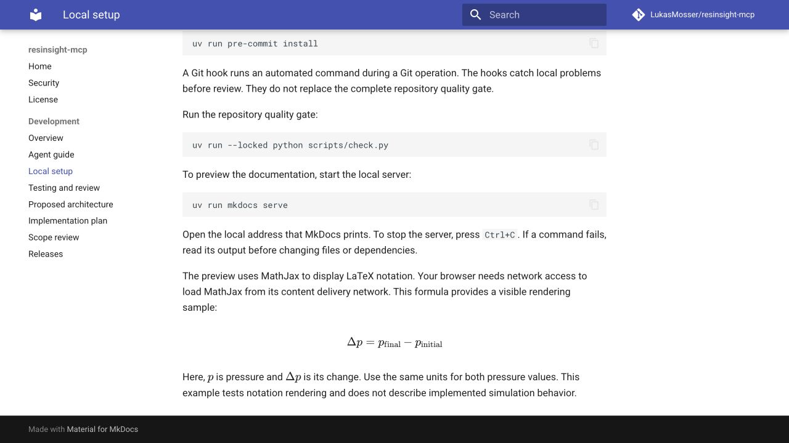

# Foundation evidence

This record covers the repository tools and documentation on September 8, 2026.
It does not claim working ResInsight control or a simulator run.
The foundation PR contains the tested source and links to GitHub Actions logs.

## Repository checks

The local run used macOS 14.2.1 on Apple silicon with Python 3.12.13.
Ruff 0.16.6, ty 0.0.79, and the strict MkDocs build passed.
The installed pre-commit hook also passed against the repository files.

The following commands produced the local evidence:

```console
uv sync --locked --all-groups
uv run --locked python scripts/check.py
uv run --locked pre-commit validate-config
uv run --locked pre-commit install
uv run --locked pre-commit run --all-files
```

Actionlint 1.7.12 accepted the three GitHub Actions workflows.
Actionlint examines workflow syntax and shell expressions.
GitHub Actions provides separate Ubuntu and macOS results for the integrated PR.

There are no application tests in this foundation.
The shared command reports that fact and does not run an empty pytest suite as a success.
The first application package must add its real tests to the shared command.

## Documentation inspection

The local browser displayed the setup guide with a rendered LaTeX equation.
The equation contained subscripts and a pressure difference.
No browser errors appeared during that inspection.

The image records the browser output from the local documentation build.
It proves the notation and page layout in that browser.
It does not prove MCP image delivery to a model.



## Independent review

Separate agents reviewed workflow permissions, release handling, and the implementation plan.
The review considered duplicate behavior, complexity, and maintenance cost.
The lead agent corrected package dependencies, scenario ownership, observation metadata, and the OPM-first release path.

The source review identified a macOS gRPC build gate and an explicit Julia result-transfer requirement.
Those findings have acceptance packages in the plan.
They remain unproved runtime requirements.
