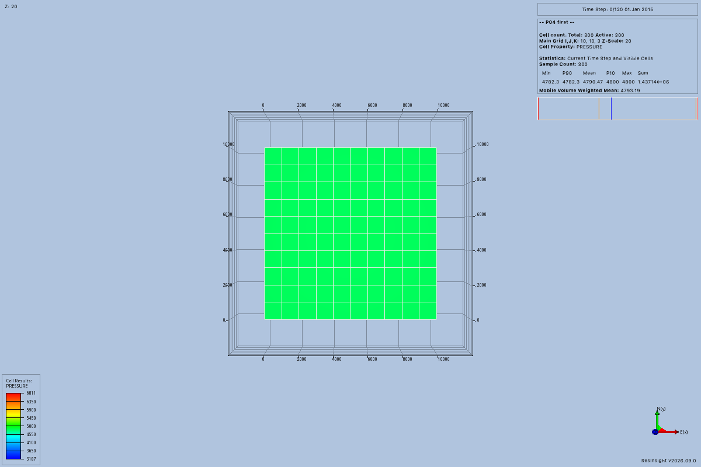

# Shipped launcher acceptance

The first session launcher slice passed native acceptance on September 9, 2026.
The trial used a fresh noneditable installation and the shipped `python -m resinsight_mcp.mcp` command.
All engineering setup used public MCP tools.
The result covers sessions and projects within [issue #35](https://github.com/LukasMosser/resinsight-mcp/issues/35).
It does not complete that issue's domain integration or full workflow acceptance.

## Tested installation

The installed package source was `8470225cf74edb8a592a47d4777c7c4f03c98c58`.
The [install command](evidence/launcher/install-command.json) and [log](evidence/launcher/install.log) record the locked installation.
It used `uv sync --locked --no-dev --extra resinsight --no-editable` with a fresh `UV_PROJECT_ENVIRONMENT`.
The acceptance runner was added after installation and uses the installed package.

The [environment record](evidence/launcher/environment.json) identifies Python 3.12.13, MCP 1.30.0, and released `rips==2026.9.0.1`.
The package loaded from the environment's `site-packages`, with editable installation disabled.
The runner started outside the repository, and each launcher process used a separate external working directory.
Neither `PYTHONPATH` nor `PYTHONHOME` was set.
The explicit `QT_PLUGIN_PATH` selected the existing Qt 6.7.0 plugins.

The native source was `119850cfcfc761b5d4deffce42910c74e5853214`.
The [successful build record](evidence/launcher/native-build.json) preserves the P01 macOS configuration and OpenZGY overlay limits.
This slice uses existing session APIs and needs no generated-client source override.

The input was the archived [P04 project](evidence/p04/P04%20first.rsp).
The [input record](evidence/launcher/project-input.json) records its existing external references.
The runner also checked the grid's initialization, restart, and summary files before opening the project.
It did not load cases through a private setup operation or create model, result, or simulator records.

## Observed operations

The [result](evidence/launcher/result.json) records one application and 18 completed public tool calls.
The [events](evidence/launcher/events.jsonl) retain complete tool requests, responses, catalogs, and process checks.
The [runner log](evidence/launcher/acceptance.log) preserves output from the completed trial.

| Check | Observed result |
| --- | --- |
| Workspace launcher | Advertised only the four workspace tools and created the durable session. |
| Configured launcher | Advertised existing session and project tools without view, job, or model tools. |
| Native launch | Returned an owned connection with a verified process lifetime and endpoint. |
| Project operations | Opened the archived project, resolved its case and view, saved, closed, and reopened it. |
| Saved project | The [output project](evidence/launcher/saved-project.rsp) names the requested destination. |
| Stale references | Earlier references failed after project changes and after reconnecting. |
| MCP restart | The application survived, and the durable session remained readable. |
| Explicit reattachment | Project inspection first failed with `not_found`, then attachment issued a fresh connection identity. |
| Public detach | Recorded detached state while the original application continued running. |
| Cleanup | Verified the original lifetime, executable, command, and endpoint before graceful native shutdown. |

The restarted service did not reconstruct its application connection from workspace records.
The caller supplied the prior endpoint through `application_attach`.
Cleanup ran only after public detach and used native `Exit` for the trial's verified process.
The final event records confirmed termination.

## Image and review limits

The following image independently records the reopened project.
It was captured directly through the native client, without changing view settings.
No MCP image response or model-provider observation is claimed.

The [review record](evidence/launcher/review.json) describes the visible grid and its native overlay.
The image shows the initial pressure view with 300 active cells.
It does not establish numerical accuracy or native editor usability.
The editor inspection remains deferred under [issue #34](https://github.com/LukasMosser/resinsight-mcp/issues/34).

The 10 maintained launcher tests separately cover configuration failures, dependency failures, catalog discovery, startup output, and protocol lifecycle behavior.
Their gRPC fixture does not claim native application acceptance.
The [shared check record](evidence/launcher/checks.json) and [log](evidence/launcher/checks.log) record 350 passing tests, Ruff, ty, and strict MkDocs.
The [package notes](evidence/launcher/README.txt) identify omitted local runtime files.
The lead reviews shared user guides and browser presentation separately.
