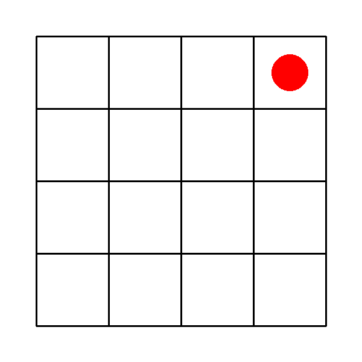
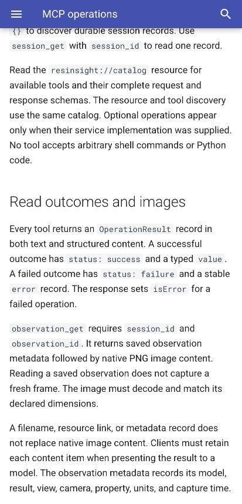
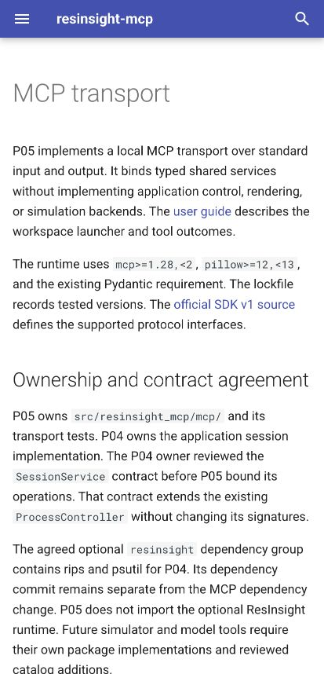

# P05 acceptance evidence

P05 passed maintained SDK tests and three blind native-image controls on September 8, 2026.
The image trials used the production transport with a synthetic observation service and real artifact storage.
They do not establish ResInsight rendering, simulator behavior, or image delivery in the current desktop task.

## Native image acceptance

The final trials used an archived source tree from commit `2842d9175ef01ebfab7fcbd67fb93edc39051f1d`.
Both the runner and MCP subprocess explicitly imported that tree.
The [image review](evidence/p05/image-review.json) records the archive command, source paths, tool versions, and results.
The [invocation wrapper](evidence/p05/final-controls.txt) preserves the final source-selection configuration.

The observer used Codex CLI 0.153.4 with `gpt-6-astra` and low reasoning.
It started without conversation history in an empty directory.
Its configuration disabled unrelated tools and used existing ChatGPT authentication.
The runner removed API key environment variables.
Each trial completed exactly one `observation_get` call with explicit session and observation identifiers.

| Control | Delivered content | Observer answer | Result |
| --- | --- | --- | --- |
| [Visible](evidence/p05/visible/audit.json) | Typed text and one decoded 600 by 600 PNG image. | Row 1, column 4. | Matched the hidden witness. |
| [Hidden](evidence/p05/hidden/audit.json) | Successful observation metadata with its image deliberately removed. | `no_image`, with null coordinates. | Rejected metadata as visual evidence. |
| [Empty](evidence/p05/empty/audit.json) | `render_failed`, with no image. | `no_image`, with null coordinates. | Rejected an empty stored artifact. |

The random marker position does not appear in observation metadata.
The gate requires matching typed text and structured content, explicit identifiers, a decoded PNG, and model-visible image content.
It rejects empty image payloads even when a guessed answer matches the witness.
It also requires the final answer after the tool response and rejects unrelated tool use.

The visible image independently confirms row 1, column 4:



Each control retains its command, client log, events, typed server content, answer, witness, and final audit.
The visible [event stream](evidence/p05/visible/events.jsonl) preserves native image content before the model's answer.
The hidden and empty controls use test fixtures, not production configuration options.
The hidden fixture removes only image content after production encoding.
The empty fixture supplies an empty image artifact to the production encoder.

Earlier development trials found and corrected client setup and acceptance-gate checks.
The final controls ran after those corrections against the recorded clean source snapshot.
All three final trials exited successfully and passed the stronger gate.

## Maintained protocol checks

The recorded P05 suite contained 143 tests before integration with P04 runtime tests.
The MCP checks cover typed discovery, explicit session resolution, durable reconnects, stable errors, and native content.
They also cover applied edits with failed observations, unrelated renderer output, and service ownership across protocol connections.
Eighteen acceptance-gate tests reject unusable images, mismatched metadata, and incorrect final-event ordering.

Stdio tests use real SDK clients and independent Python subprocesses.
The workspace tests use real SQLite databases and artifact files.
Session binding tests use an explicitly identified recording service through the SDK's in-memory client.
These tests do not claim external application control.

The shared command runs Ruff, ty, pytest, and a strict MkDocs build:

```console
uv run --locked python scripts/check.py
```

The [shared-check log](evidence/p05/shared-check.log) records 143 passing tests and the strict documentation build.
The [check review](evidence/p05/check-review.json) identifies the tested source commit and local uv version.

The recorded image environment used Python 3.12.13, MCP 1.30.0, Pillow 12.3.0, and Pydantic 2.13.5.
It used pytest 9.1.1, Ruff 0.16.6, ty 0.0.79, and pre-commit 4.6.2.
The host was macOS 14.2.1 on arm64.
Repository CI also runs the shared command on Linux and macOS before merge.

## Combined session integration

P05 was rebased onto P04 merge commit `414129da6c7e7ceab0c47b3135c59556305aacaa`.
The rebase preserved P04's implementation, shared contracts, optional runtime extra, development dependencies, and current session documentation.
The [P04 evidence record](p04-evidence.md) documents real application acceptance through P05 transport commit `2842d91`.
Two applications retained separate saved projects after the SDK client and server exited.
Fresh connections inspected both projects, and detach left both processes running.
The trial applications were later closed explicitly with verified process identities.

That trial establishes bounded session continuity through the actual transport.
The blind controls above separately establish synthetic native-image interpretation by the model.
Neither record establishes P06 rendering acceptance.

## Runtime installation

The [wheel review](evidence/p05/wheel-review.json) records installation from the built wheel into a separate environment.
That environment contained runtime dependencies without pytest or the optional rips package.
The SDK client initialized the launcher, read its catalog, and continued after an unavailable-resource error.
The launcher also rejected a relative workspace path and refused to overwrite an existing workspace.
The [check log](evidence/p05/wheel-check.log) and [reproduction script](evidence/p05/launcher-check.txt) retain this evidence.

## Review and documentation

Independent source review used `gpt-6-astra` with low reasoning.
It assessed duplication, branching, typed boundaries, ownership, maintenance, public behavior, and evidence.
The single catalog supplies tool discovery and the resource schemas.
The transport retains no selected session or application ownership table.

Review found that a renderer could return another session's image.
The correction checks returned context and requested dimensions before native delivery.
A real SDK test now rejects an unrelated session's valid PNG.
A second source review found no remaining actionable source or test issues.

Review also found an image-gate false positive for empty payloads with lucky answers.
The final gate decodes the image and checks typed metadata and event order.
All retained controls and the final clean-source trials pass those stronger checks.

The user and developer guides were built and inspected in a browser.
The screenshots record readable desktop and narrow layouts.





## Reproduce the blind controls

These commands run the actual model through the existing authenticated Codex client.
Use a new evidence path for each run.
The runner refuses to overwrite an existing directory.

```console
uv run --locked python tests/acceptance/mcp/run_observer.py \
  --codex /Applications/ChatGPT.app/Contents/Resources/codex \
  --evidence /private/tmp/p05-visible --mode visible
uv run --locked python tests/acceptance/mcp/run_observer.py \
  --codex /Applications/ChatGPT.app/Contents/Resources/codex \
  --evidence /private/tmp/p05-hidden --mode hidden
uv run --locked python tests/acceptance/mcp/run_observer.py \
  --codex /Applications/ChatGPT.app/Contents/Resources/codex \
  --evidence /private/tmp/p05-empty --mode empty
```

Wait for each observer to finish before inspecting its witness or marker.
The runner returns failure unless its mode-specific acceptance gate passes.
A successful CLI exit alone does not establish image acceptance.
