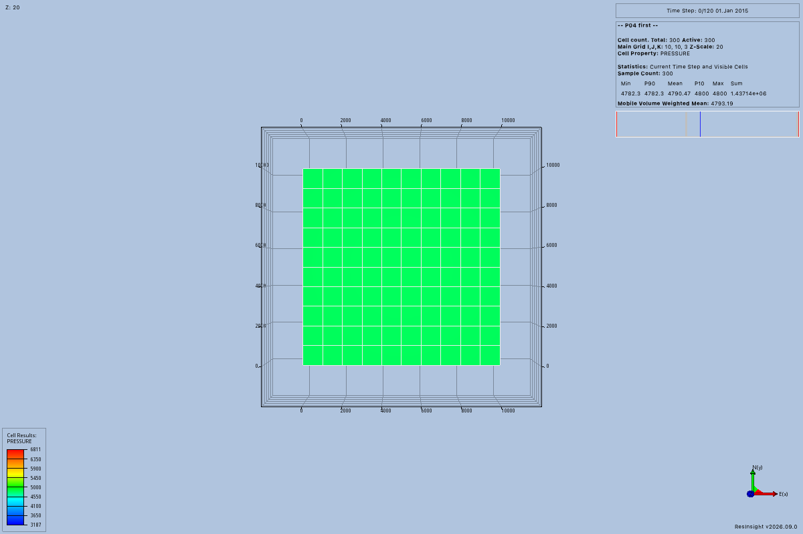

# P04 acceptance evidence

P04 passed a two-application trial on September 8, 2026, using the actual P05 standard input and output transport.
Both applications retained separate projects after the SDK client disconnected.
New connections inspected those projects and detached without terminating either application.
The trial also rejected stale references and detected an external case name change without changing the other session.

The [session guide](../sessions.md) describes the supported API.
The [implementation guide](sessions.md) defines ownership, failure meanings, and observation limits.

## Tested sources and environment

| Component | Tested value |
| --- | --- |
| P04 source and acceptance runner | `91102cb3a6fad244c5a36f544649a2ef654b2e68` |
| P05 transport source | `2842d91`, from its separate reviewed worktree |
| Host | macOS 14.2.1, arm64 |
| Python | 3.12.13 |
| ResInsight | 2026.09.0, custom gRPC build from the P01 record |
| rips | 2026.9.0.1 |
| MCP Python SDK | 1.30.0 |
| grpcio | 1.83.1 |
| psutil | 7.2.2 |
| Input | P01 SPE1CASE1 result, 10 × 10 × 3 cells |

The [P01 application record](platform-resinsight.md) records the build, upstream commit, patches, and component licenses.
Both trial projects used the same small input in separate application processes.
No new simulator run was required for P04.
The native fixture selected `CUSTOM_NAME` so its case names survived save and reopen.

The [environment record](evidence/p04/environment.json) preserves the command and runtime package versions.
The [source record](evidence/p04/source-commits.json) identifies the combined source tree.
The temporary tree copied P04 source and added only P05's committed `src/resinsight_mcp/mcp/` directory.
P05 production transport code is not included in the P04 feature change.

## Runtime command

The [runner](https://github.com/LukasMosser/resinsight-mcp/blob/main/tests/acceptance/sessions/run.py) requires the explicit application, input case, output directory, and combined source tree.
Its [server fixture](https://github.com/LukasMosser/resinsight-mcp/blob/main/tests/acceptance/sessions/server.py) supplies real workspace and session services to `serve_stdio()`.
The command below records this host's paths, rather than portable installation locations.

```sh
app_root=/private/tmp/resinsight-p01-build/application-build
app_exe="$app_root/ResInsight.app/Contents/MacOS/ResInsight"
case_root=/private/tmp/resinsight-mcp-p01-opm
case_file="$case_root/experiments/platform/opm/output/SPE1CASE1.EGRID"
qt_root=/private/tmp/resinsight-p01-build/qt/6.7.0/macos
LC_ALL=en_US.UTF-8 \
QT_PLUGIN_PATH="$qt_root/plugins" \
.venv/bin/python tests/acceptance/sessions/run.py \
  --executable "$app_exe" \
  --case "$case_file" \
  --output /private/tmp/resinsight-p04-acceptance-04 \
  --transport-source /private/tmp/resinsight-p04-overlay-04 \
  --keep-applications
```

The runner leaves applications running only when `--keep-applications` is supplied.
The trial retained them for inspection before explicit cleanup of the recorded test processes.
The [application events](evidence/p04/events.jsonl), [runner log](evidence/p04/acceptance.log), and [transport log](evidence/p04/mcp-stderr.log) preserve the observed sequence.
The SDK parsed successful responses while application output went to separate files.

## Observed results

| Check | Observed result |
| --- | --- |
| Separate applications | PIDs 41208 and 41301, with distinct verified start markers and endpoints. |
| Separate projects | `P04 first` and `P04 second` saved to different project files and reopened with their own case names. |
| Saved project structure | Parsed XML identified a ResInsight project and the requested output path. |
| Stale project references | MCP requests rejected references from before a save or an observed external name change. |
| External change isolation | Renaming the first case invalidated its context while the second project state remained equal. |
| Project close and reopen | Closing produced an empty object inventory; reopening restored the first saved project. |
| Client disconnect | Both original process identifiers and start markers remained valid after the SDK client and server exited. |
| New connections | Reattachment retained the process identities and issued new connection identifiers. |
| Stale connection references | The service rejected object references from the previous connection. |
| Attached detach | Both processes remained running after their new attached connections detached. |

The [first project file](<evidence/p04/P04 first.rsp>) and [second project file](<evidence/p04/P04 second.rsp>) preserve their separate save paths.
Their input references use the recorded host paths and require the original fixture files to reopen elsewhere.
The [runtime review](evidence/p04/runtime-review.json) records an independent evidence review and the corrected trial fixture assumptions.

## Native frames

The fixture exported and decoded these separate 1200 × 800 frames before saving its projects.
Both frames show the small grid, pressure legend, and their distinct case labels.
They are native application output saved for inspection.
They do not establish P06 rendering or blind model interpretation of MCP image content.




## Maintained tests

The maintained suite contains 129 tests, including 22 session service and project contract cases and eight native client cases.
The session tests use real workspace storage and a controlled application boundary.
They cover explicit targeting, duplicate process bindings, concurrency, reconnects, stale references, project paths, blank names, ownership, and uncertain outcomes.
Four regression cases failed before the lifecycle review fixes and passed afterward.

Native client tests use separate processes that implement the upstream remote call protocol.
They establish host process verification, application process group isolation, channel detachment, confirmed termination, version rejection, and remote failure handling.
They do not substitute for the real application trial above.

The shared command runs Ruff, ty, pytest, and the strict documentation build.
The [final review record](evidence/p04/final-review.json) records 129 passing tests and successful Linux and macOS CI checks at source commit `09c0ceb`.
Reviewed browser captures cover the user guide, implementation, evidence, and affected shared pages.

## Installed package and cleanup

A wheel built from `09c0ceb` passed checks in two fresh Python environments.
The [base package check](evidence/p04/base-proof.json) imported session coordination without rips or psutil.
The [native package check](evidence/p04/native-proof.json) ran the documented example and inspected both retained application projects.
Imports came from the installed wheel in each environment.
The [build log](evidence/p04/package-build.log) and [native installation log](evidence/p04/package-native.log) preserve the package commands and results.

The example application was explicitly terminated after its successful detach check.
The two acceptance applications were then closed through the session service with verified identities and trusted termination authorization.
The [cleanup record](evidence/p04/cleanup.json) also shows rejection of termination requests without that separate authorization.

## Limits

This record establishes one custom ResInsight build on one macOS host.
The native adapter requires `lsof`, the optional Python dependencies, and matching application and rips major and minor versions.
The trial does not establish a general operating system or application version matrix.

Snapshot comparison detects only observed changes to the project root and selected case, view, and well fields.
Identical empty-project reopenings, reused native addresses, and unobserved field changes can remain undetected.
No atomic lock prevents changes through another process or the application interface during observation.
Use one controller for each application and avoid simultaneous manual project changes.

Application save operations do not create engineering revisions or verify simulator input lineage.
Project checkpoints remain separate workspace records.
No simulator or renderer acceptance claim follows from these session results.
