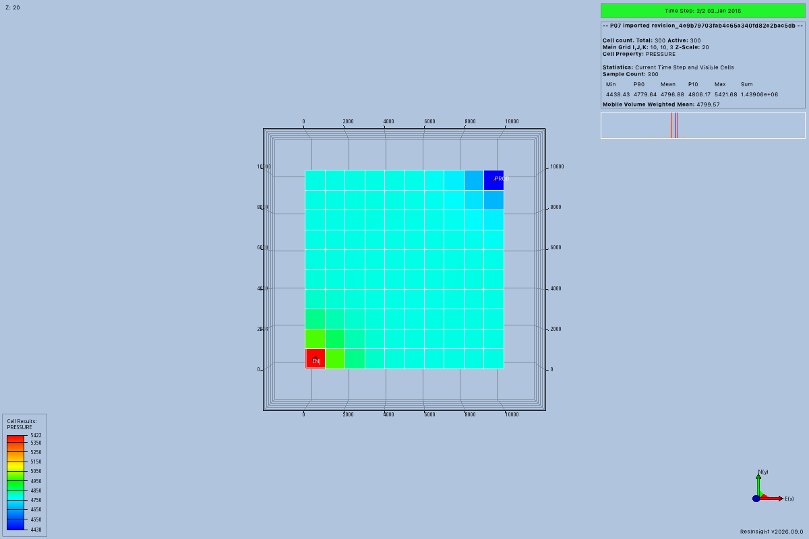

# P07 import evidence

The bounded import acceptance passed on September 8, 2026.
The tested implementation commit is `f582165d84ee8fdd838d7ccbe552be7a94e41a8c`.
Its working tree was clean during the recorded runtime trial.
The [acceptance record](evidence/p07/acceptance.json) contains the source revision, prepared inputs, application connection, and loaded case.
The [package guide](model-imports.md) defines the supported profile and its limits.
This trial uses Python preparation and trusted application setup.
It does not complete an agent workflow through the production MCP server.

## Result and lineage

The input contains a main deck and four include files.
The service stores all five sources as immutable input artifacts.
Its [import record](evidence/p07/import-record.json) maps each relative path to an artifact identifier and records each include edge.
The separate change list is empty because import makes no input edits.

The prepared revision is `revision_4e9b79703fab4c65a340fd82e2bac5db`.
Its session is `session_7353623320114a8db564401c11f9476e`.
The [receipt](evidence/p07/import-receipt.json) connects that revision to the model summary and import record.
The trial removes its temporary source copy before preparing the stored revision again.
It then reconstructs the OPM run inputs from those fixed workspace artifacts.

Flow 2026.04 returns exit status 0 after two report steps and two simulated days.
The final report date is January 3, 2015.
The [complete run log](evidence/p07/flow-run.log) records both steps and zero wasted linearizations or iterations.
It contains no unsupported-keyword warning for this fixture.
The run creates `EGRID`, `INIT`, `UNRST`, `SMSPEC`, and `UNSMRY` outputs.

ResInsight loads the resulting `SPE1.EGRID` as case 0 in the recorded connection.
The case name includes the full revision identifier.
It reports a 10 × 10 × 3 grid with 300 active cells and three dated states, including the initial state.
At report step 2, its 300 pressure values range from 4,438.43 to 5,421.68 psia.
These are observed values, without an independent numerical reference claim.

The reviewed image shows the field, pressure legend, report date, revision identifier, and both well names.
The high-pressure injector appears at the lower left, and the producer appears at the upper right.
The decoded image dimensions are 1,200 × 800.
The published copy below preserves the exported image with a shorter filename.



## Rejection before submission

The trial first removes the fluid-property include from a separate invalid source copy.
Import returns `INVALID_MODEL` before storing artifacts or creating a job.
The [failure record](evidence/p07/invalid-input.json) identifies the missing include.
Only the later successful import reaches the bounded simulator command.
The package itself has no simulator submission method.

The maintained import tests also cover conflicting units, unsupported physics, malformed syntax, missing controls, and invalid completions.
Source tests cover nested includes, empty include files, cycles, external paths, symlinks, consumed directives, and repeated expansion.
The tests make sure that original-source removal does not prevent preparation after reopening the workspace.

## Environment and commands

The runtime host uses macOS 14.2.1 on arm64 with Python 3.12.13.
The parser is `opm==2025.10`, and the client is `rips==2026.9.0.1`.
The loaded application reports ResInsight 2026.9.0.
The trial uses the preserved P01 bundle at `/private/tmp/resinsight-p06-baseline-ResInsight.app`.
P06 preserved that bundle before rebuilding its separate view changes.
The [application log](evidence/p07/resinsight.log) belongs to this owned acceptance launch.

Docker client and engine versions are 29.3.1.
The [Docker version log](evidence/p07/docker-version.log) and [Flow version log](evidence/p07/flow-version.log) record the observed environment.
The trial reuses the P01 Linux arm64 image by its registry digest.
It uses two CPUs, 2 GiB of memory, no network, and a 60-second Flow timeout.
The input mount is read-only, and outputs use a separate temporary directory.

Run the probe from the repository root with an unused output path:

```sh
QT_PLUGIN_PATH=/private/tmp/resinsight-p01-build/qt/6.7.0/macos/plugins \
uv run --locked python tests/models/imports/acceptance.py \
  --output /private/tmp/resinsight-mcp-p07-acceptance \
  --resinsight /private/tmp/resinsight-p06-baseline-ResInsight.app/Contents/MacOS/ResInsight \
  --docker /Applications/Docker.app/Contents/Resources/bin/docker
```

The probe launches one owned ResInsight process and terminates that connection after the image export.
Its bounded Docker command appears in the run log.
This test probe does not implement P11 simulator adaptation or P10 job control.

## Parser decision

The official OPM 2025.10 wheel successfully parses the fixture and constructs `EclipseState` and `Schedule` on this host.
The dependency pin is explicit, and the service rejects a different installed parser version.
An isolated [2026.4 wheel diagnostic](evidence/p07/parser-2026.4-rejected.log) fails because its external `cjson` library is absent.
The loader also reports a macOS 26 build despite the macOS 14 wheel tag.
That failed trial does not establish support for the 2026.4 Python wheel.

## Review and checks

The shared repository command passes 212 tests, Ruff, ty, and the strict documentation build for the tested implementation.
Of those tests, 39 exercise public import behavior, source limits, parser isolation, and publication failures.
The [check log](evidence/p07/checks.log) records the required command, tested revision, and tool versions.
The combined pre-commit check runs the same repository command after integration.
Browser inspection confirms that both package pages render, including the units table and native result image.

Independent review examined duplicate behavior, branching, naming, ownership, coupling, maintenance, and observable failure tests.
The source collector handles file references and limits, while OPM owns model parsing and construction.
The parser process stays separate from workspace storage and native application operations.
Review found and closed directive bypasses, repeated include expansion, malformed quote failures, and incomplete well controls.
A regression also rejects shut completions before OPM silently closes a requested open well.
Final review closed Python module shadowing, oversized repetition conversion, and incorrect effects after partial publication.
Harmless execution markers remain absent when imported sources use Python package names.
Store failure tests reopen the workspace and make sure that `UNKNOWN` matches remaining artifacts or a saved revision.
The native trial was repeated after those repairs with isolated parser startup and a clean working tree.

## Data terms and limits

The fixture derives from OPM SPE1 at commit `0ea62974f24d70fc2b3e30d6aae8b76ef000dac1` and retains the 2015 Statoil attribution.
The [fixture README](https://github.com/LukasMosser/resinsight-mcp/blob/main/tests/models/imports/data/README.md) records changes made before import.
The [Open Database License 1.0](https://opendatacommons.org/licenses/odbl/1-0/) applies to the input and these public derived results.
The input contents use the [Database Contents License 1.0](https://opendatacommons.org/licenses/dbcl/1-0/).

This result proves one supported imported model on the selected host.
It does not establish simulator convergence for every accepted input or independent numerical accuracy.
It does not add model editing, production simulator jobs, result comparison, or an MCP import tool.
The [P01 platform record](platform-proof.md) describes the reused runtime and its wider limits.
