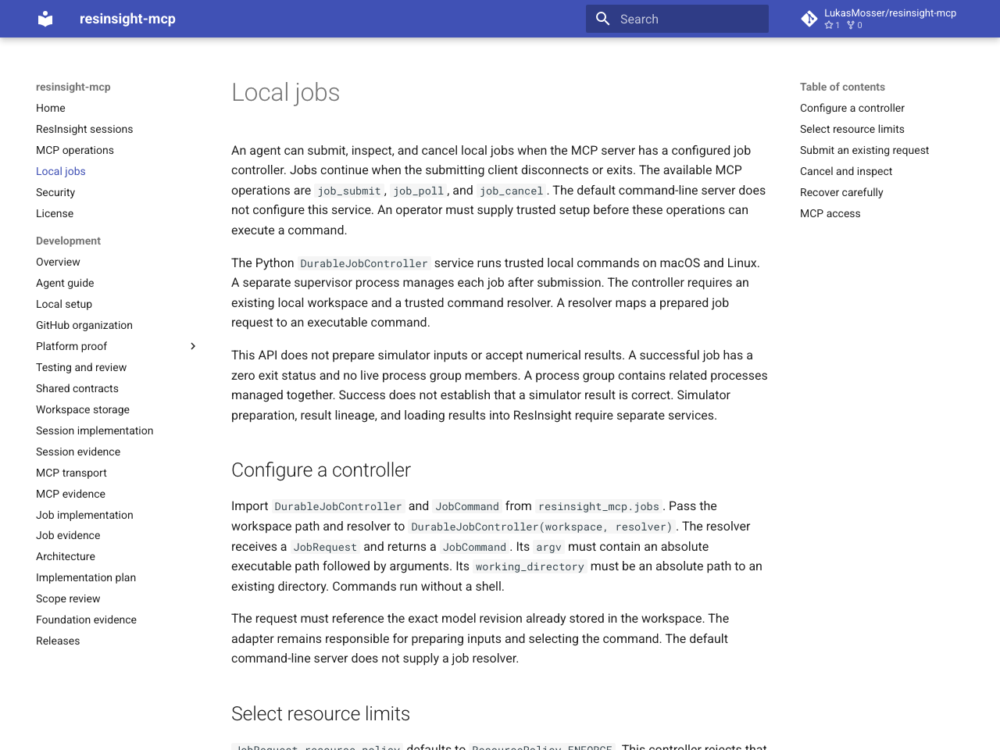
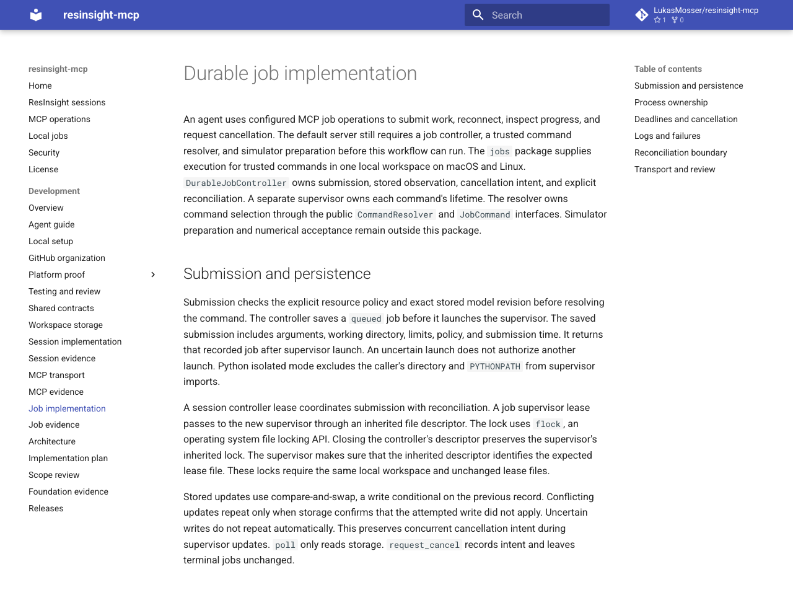
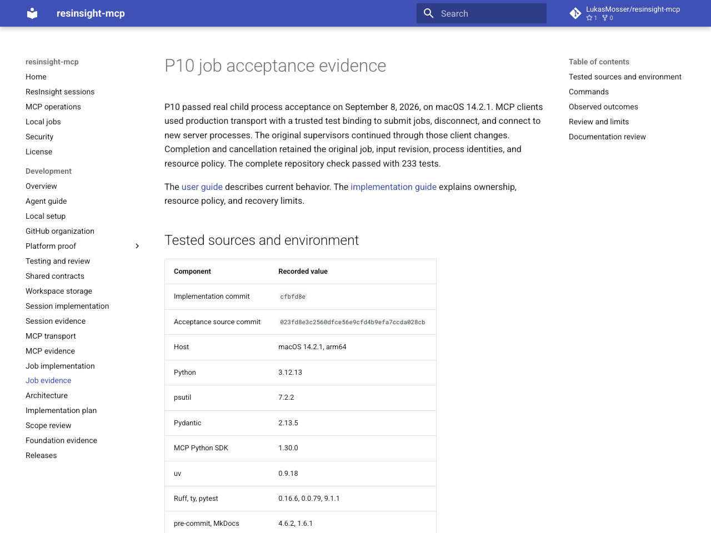

# P10 job acceptance evidence

P10 passed real child process acceptance on September 8, 2026, on macOS 14.2.1.
MCP clients used production transport with a trusted test binding to submit jobs, disconnect, and connect to new server processes.
The original supervisors continued through those client changes.
Completion and cancellation retained the original job, input revision, process identities, and resource policy.
The complete repository check passed with 233 tests.

The [user guide](../jobs.md) describes current behavior.
The [implementation guide](jobs.md) explains ownership, resource policy, and recovery limits.

## Tested sources and environment

| Component | Recorded value |
| --- | --- |
| Implementation commit | `cfbfd8e` |
| Acceptance source commit | `023fd8e3c2560dfce56e9cfd4b9efa7ccda028cb` |
| Host | macOS 14.2.1, arm64 |
| Python | 3.12.13 |
| psutil | 7.2.2 |
| Pydantic | 2.13.5 |
| MCP Python SDK | 1.30.0 |
| uv | 0.9.18 |
| Ruff, ty, pytest | 0.16.6, 0.0.79, 9.1.1 |
| pre-commit, MkDocs | 4.6.2, 1.6.1 |

The [environment record](evidence/p10/environment.json) preserves full versions and the tested source identifier.
The [acceptance log](evidence/p10/acceptance.log) records 36 passing job tests and final MCP job records.
These tests use small Python commands with fixed input revision records.
They do not run ResInsight, OPM, or another simulator.

## Commands

The recorded job acceptance command was:

```sh
UV_CACHE_DIR=/private/tmp/resinsight-mcp-uv-cache \
LC_ALL=en_US.UTF-8 \
uv run --locked pytest tests/jobs -vv -s
```

The required repository command was:

```sh
UV_CACHE_DIR=/private/tmp/resinsight-mcp-uv-cache \
LC_ALL=en_US.UTF-8 \
uv run --locked python scripts/check.py
```

Ruff, formatting, ty, all 233 tests, and the strict documentation build passed.
The implementation commit also passed the repository pre-commit hook.
The [shared check log](evidence/p10/shared-check.log) preserves final documentation checks with the application suite.
The [guide example record](evidence/p10/guide-example.json) records successful execution of the documented Python example.
The host run uses normal process inspection permissions.
A restricted trial blocked `psutil.pids()` with `PermissionError` and correctly left execution unknown.

## Observed outcomes

| Case | Observed result |
| --- | --- |
| Asynchronous submission | Submission returned the durable queued record before command completion. |
| Caller module substitution | Isolated startup used the installed supervisor despite conflicting caller files and `PYTHONPATH`. |
| MCP disconnect and restart | New server processes read the original running job and process identities. |
| Completion after reconnect | The original command completed once with zero status and immutable log references. |
| Cancellation after reconnect | Cancellation intent survived and the owned group had no live child after termination. |
| Exited group leader | The supervisor retained ownership while a descendant remained alive. |
| Ignored termination | The supervisor escalated from `SIGTERM` to `SIGKILL` and confirmed termination. |
| Stale process identity | Rejected ownership did not signal the unrelated live process. |
| Interrupted launch | Recovery retained the original job and revision as unknown without launching a command. |
| Supervisor death | Recovery preserved process records and uncertainty without signaling stored identifiers. |
| Cancel during claiming | Expected-state retries retained cancellation and avoided command execution. |
| Delayed state publication | The wall deadline stopped execution while the running-state write was delayed. |
| Failed process inspection | Verified signals still escalated while the final outcome remained unknown. |
| Failed deadline thread | The owned command stopped and the job retained an uncertain outcome. |
| Failed supervisor waiter | The response retained the durable job identifier and an unknown mutation effect. |
| Failed log publication | A completed command did not become a falsely successful job. |
| Changed process inventory | An omitted descendant prevented an empty-group confirmation. |

The [MCP job records](evidence/p10/mcp-jobs.json) retain exact identifiers, arguments, resources, events, and log references.
The completion trial produced `succeeded` with exit status zero.
The cancellation trial produced `canceled` with confirmed termination.
The tests compare initial and restored records and inspect the child after cancellation.
Exited zombie entries do not count as live processes.

The maintained cases are in [service tests](https://github.com/LukasMosser/resinsight-mcp/blob/main/tests/jobs/test_service.py), [process tests](https://github.com/LukasMosser/resinsight-mcp/blob/main/tests/jobs/test_process.py), and [failure tests](https://github.com/LukasMosser/resinsight-mcp/blob/main/tests/jobs/test_faults.py).
The [MCP acceptance test](https://github.com/LukasMosser/resinsight-mcp/blob/main/tests/jobs/test_mcp_acceptance.py) uses the [trusted server fixture](https://github.com/LukasMosser/resinsight-mcp/blob/main/tests/jobs/mcp_server.py).
The fixture supplies the actual workspace store and job controller to production `serve_stdio()`.
This proves the configured MCP job operations, not a complete simulator workflow through the default server.
The default server still needs job service composition and trusted simulator preparation.

## Review and limits

Independent reviews assessed duplicate state, branching, ownership, coupling, tests, and failure evidence.
Review found and corrected races in supervisor claiming, launch acknowledgement, deadline handling, process inspection, and thread startup.
Synchronized regression cases establish the corrected behavior with real commands.
Workspace persistence remains the single durable source of job state.

The explicit `wall_time_only` policy enforces the wall deadline and records CPU and memory requests without enforcement.
The default `enforce` policy fails before durable submission or child creation.
Operating system scheduling and termination grace periods can extend the observed stop time.
Supervisor startup itself is not a real-time operation.

Commands must keep descendants in their original process group.
The supervisor must retain exclusive ownership of child reaping.
A stopped supervisor does not prove that its command stopped.
Recovery never relaunches commands or terminates surviving processes from stored identifiers.
Runtime leases require the original trusted local workspace and unchanged files.
This package does not provide simulator preparation, numerical acceptance, or a process sandbox.

## Documentation review

The package guides and evidence page were rendered with the strict MkDocs build.
The browser review checks navigation, code blocks, tables, links, and readable page layout.
The saved screenshots preserve the reviewed pages.







The [example screenshot](evidence/p10/jobs-example.png) shows the reviewed code block.
