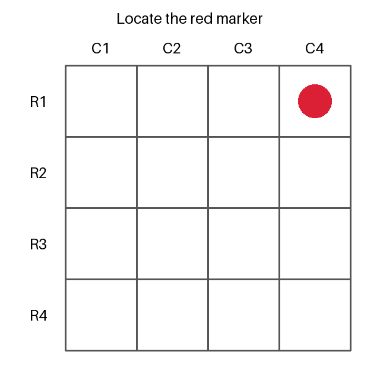

# Native image experiment

This P01 experiment tests native MCP image delivery through the Codex CLI.
A native image is an MCP content item with `type: image`.
The experiment uses a random marker instead of ResInsight output.

It does not establish image delivery in the existing desktop task.
It does not establish ResInsight rendering, model editing, or simulation support.
Those results need separate experiments with their actual application and client.

## Recorded result

The corrected run on September 8, 2026 passed.
The observer answered row 1, column 4 before the reviewer opened the witness or image.
The witness also records row 1, column 4.

| Property | Recorded value |
| --- | --- |
| Client | App-bundled Codex CLI 0.153.4 |
| Model | `gpt-6-astra`, low reasoning |
| Host | macOS 14.2.1, arm64 |
| Libraries | MCP 1.30.0 and Pillow 12.3.0 |
| Completed tool calls | One call to `p01_image` / `observe` with empty arguments |
| Tool content | One `image/png` image block, no text, no structured content |
| Other tool calls | None |
| Observer answer | Row 1, column 4 |
| Hidden witness | Row 1, column 4 |

The [evidence directory](https://github.com/LukasMosser/resinsight-mcp/tree/main/experiments/platform/images/evidence/codex-cli-2026-09-08-corrected) contains the complete client events, image, answer, witness, and review summary.
The event stream retains the native image content before the final answer.
The code-mode host remained enabled because this client needs it to route MCP tools.



Two setup attempts preceded this result.
The first stopped before model contact because strict configuration rejected `tools.view_image`.
The second returned `no_image` because disabling the code-mode host removed the MCP tool route.

Neither setup attempt generated a marker or tested image perception.
Their [logs remain available](https://github.com/LukasMosser/resinsight-mcp/tree/main/experiments/platform/images/evidence) beside the successful evidence.
The correction uses the installed `view_image` feature flag and retains the code-mode host.

## Method

The server exposes one `observe` tool through the official MCP Python SDK.
Pillow draws a four-by-four grid with row and column labels.
The tool chooses the marker's position with fresh operating system randomness after the observer calls it.

The response contains one PNG image block and no text block.
A witness is the answer retained for later comparison.
The server writes a separate witness file with the correct row and column.

The observer starts in an empty temporary directory without inherited conversation.
Its instructions permit only one call to the marker tool.
The runner disables shell access, local image access, plugins, browser access, and other tool features for this invocation.

The runner uses existing ChatGPT authentication and requires that authentication method.
It removes `OPENAI_API_KEY` and `CODEX_API_KEY` from the child environment.
It passes MCP configuration through command arguments without changing global configuration files.

The runner retains model events and the final answer before anyone reads the witness.
The evidence review compares that answer with the witness and inspects every recorded tool call.
A trial fails if another tool supplies the answer or if the response contains no native image.

The runner's exit status records CLI completion, not experiment acceptance.
The setup trial that returned `no_image` also exited with status zero.
Acceptance requires the documented review of the answer, witness, and native tool result.

## Reproduce

This command starts a real Codex model run and consumes account usage.
Use a new evidence directory for each authorized run.
The runner refuses to overwrite an existing directory.

From a checkout with locked development dependencies, run:

```sh
uv run --locked python experiments/platform/images/run_observer.py \
  --codex /Applications/ChatGPT.app/Contents/Resources/codex \
  --evidence /private/tmp/resinsight-native-image-evidence
```

Wait for the observer to exit before opening `witness.json` or `marker.png`.
Read `answer.json` and `events.jsonl` first.
Then compare the answer with `witness.json`.

Keep the complete evidence together:

- `invocation.json` records the command, environment versions, and initial directory state.
- `events.jsonl` records the client events and tool result.
- `answer.json` records the observer's final response.
- `witness.json` records the hidden answer.
- `marker.png` preserves the rendered observation.
- `server-content.json` records the image content returned by the server.
- `client.log` and `exit-code.txt` record execution failures and status.

A passing trial supports delivery for its recorded client and model combination.
One correct location alone does not exclude a lucky guess.
The native image result and absence of other tool calls provide the additional delivery evidence.

## Sources

The [official MCP Python SDK](https://github.com/modelcontextprotocol/python-sdk) provides the server and image content types.
This experiment uses its maintained v1 release line with an upper bound below v2.
This dependency choice does not define the application's future SDK contract.

Installed MCP 1.30.0 metadata declares the MIT license.
Installed [Pillow](https://github.com/python-pillow/Pillow) 12.3.0 metadata declares `MIT-CMU`.
The original experiment code and generated marker use the repository's GPL-3.0-or-later license.

The [official Codex MCP guide](https://learn.chatgpt.com/docs/extend/mcp?surface=cli) describes local server configuration.
The [official non-interactive guide](https://learn.chatgpt.com/docs/non-interactive-mode) describes the CLI event stream.
Installed CLI help defines the command support for the recorded run.
