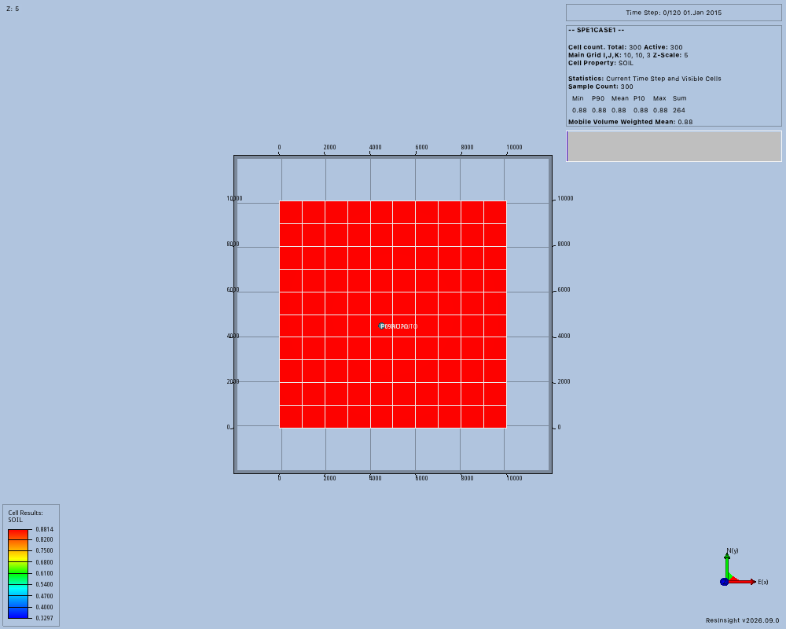
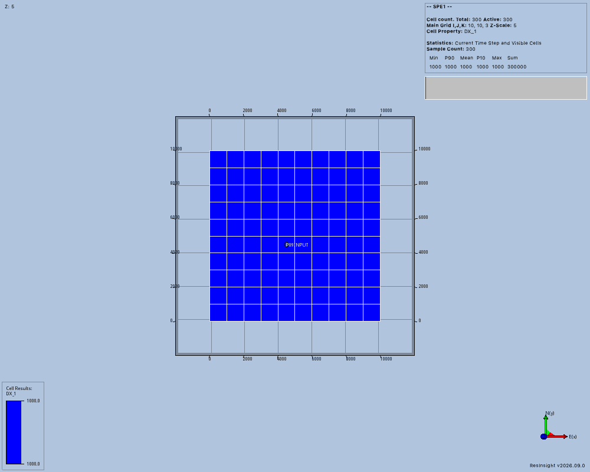

# Wells and simulator inputs

P09 connects modeled well paths to fixed simulator input revisions.
A completion connects a well to reservoir cells.
Native edits and simulator input publication remain separate operations.
This page records development evidence before the services are complete.

## Native feasibility

The first probe used repaired native commit `1859d96e9a40093abfc43c42df9e9ef5b3846c9d`.
It loaded the P01 FIELD grid `SPE1CASE1.EGRID` through the supported RIPS API.
It created three modeled well paths without importing trajectories.
The owned process used an automatically assigned local port.
Process 7383 had start marker `1788938007.638789` and exited with status 0.
The [baseline events](evidence/p09/baseline/events.json) preserve these observations.
The [application log](evidence/p09/baseline/application.log) records the native process output.

The source and runtime results establish these separate behaviors:

- Appending targets triggers geometry calculation through the existing native signal.
- Updating a target also recalculates geometry.
- An explicit sea-level target requires `use_auto_generated_target_at_sea_level = False`.
- With that setting, the vertical path returns 170 samples and ends at 8,430 feet.
- Updating its final target changes the endpoint to 8,450 feet.
- Target input and trajectory output both use positive-down depth in this API.
- Generic creation retains METRIC well units despite the loaded FIELD case.
- Those mismatched wells return no COMPDAT records and export only multisegment files.

COMPDAT records describe simulator connections.
The original P01 trajectory failure came from combining an explicit sea-level target with the automatic sea-level target.
That failure does not require a geometry implementation change.
The FIELD unit mismatch requires a case-aware creation command.

The proposed native command is `create_modeled_well_path_for_case(case_id, name)`.
It obtains units from the explicitly selected loaded case.
It rejects missing cases, unsupported units, empty names, and duplicate names before creating an object.
The native patch changes only `RimcWellPathCollection.h` and `RimcWellPathCollection.cpp`.
Existing target APIs and the P06 repair remain unchanged.
Native commit `9b469c2` contains that patch.
The lead reviewed and integrated it as `6ad2833930b3c1f8cc2939b08584f89e79dfd082`.
The [native build](evidence/p09/native-build/build-command.json) and matching Python client generation passed.
The [native patch](evidence/p09/native-build/modeled-well-units.patch) preserves the reviewed source change.
The existing P01 macOS overlays remain in place.
Those overlays enable macOS gRPC and modify the pinned OpenZGY submodule.
P09 changed neither overlay.

## Corrected native result

The case-aware probe passed 19 checks on September 9, 2026.
Its Python source matches repository commit `66c1f39367afc0d1a740bdea01f9ce4a4ef87346`.
The native process reported ResInsight `2026.9.0` at integrated commit `6ad2833930b3c1f8cc2939b08584f89e79dfd082`.
Process 14005 used start marker `1788938522.800408` and local port 56026.
It exited with status 0, and the probe confirmed its absence.
The [case-aware events](evidence/p09/case-aware/events.json) preserve all 19 checks.
The [version record](evidence/p09/versions.json) identifies the tested dependencies and source commits.

Both paths persist FIELD units and return the intended three active connections.
The one-based exported cells are `(5, 5, 1)`, `(5, 5, 2)`, and `(5, 5, 3)`.
The exported well names, OPEN status, and connection factors match the structured native response.
The factor comparison uses relative tolerance `1e-6` for the export's rounded decimal values.
Missing cases, empty names, and duplicate names fail without changing the observed well list.
Trajectory creation and target updates retain the expected positive-down endpoints.

The screenshot shows the grid and both well labels at their shared test column.
It does not establish subsurface geometry by itself.
The trajectory arrays and connection records establish that separate result.
The shared repository command passed 340 tests, Ruff, ty, and the strict documentation build.
Those 340 tests do not include the separately launched native probe.

Both wells produce the same connections in this bounded geometry experiment.
The [P09NOAUTO export](evidence/p09/case-aware/P09NOAUTO.inc) contains these rounded FIELD values.
Permeability-length describes permeability multiplied by the connected interval length.

| One-based cell | Measured depth, feet | Connection factor | Permeability-length, mD feet | Direction |
| --- | --- | --- | --- | --- |
| 5, 5, 1 | 8326–8345 | 10.07878 | 9500 | Z |
| 5, 5, 2 | 8345–8375 | 1.591386 | 1500 | Z |
| 5, 5, 3 | 8375–8424 | 10.39706 | 9800 | Z |

Each connection is OPEN, with diameter 0.5 feet and skin factor zero.
The additional multisegment files remain evidence artifacts and are not accepted simulator inputs.

## Bounded probe

The manual probe is `tests/resinsight/wells/native_probe.py`.
It is excluded from default pytest collection by its filename.
It requires explicit executable, grid, output, and creation arguments.
Each run requires a new output directory and records the launch command, process identity, observations, and cleanup.
The `generic` route measures existing behavior.
The `case-aware` route requires the reviewed native command and checks rejected creation, geometry, and exported connections.

The probe compares exported COMPDAT records through the official OPM parser.
It does not submit a simulator job or establish full P09 acceptance.
It does not change simulator physics or use an imported trajectory after failure.

## Agreed service boundary

Shared controls belong to `contracts/wells.py`.
P09 owns native trajectory and completion records.
The lead reviews shared import inspection and revision publication interfaces.
The P07 follow-up implements these interfaces in a separate logical commit.
Its completion profile accepts explicit connection factors, permeability-length values, skin factors, and directions.
That profile preserves the existing black-oil physics.

## Prepared input probe

The manual probe `tests/resinsight/wells/input_probe.py` tests fixed inputs without a simulator run.
It imports the preserved SPE1 files through the model service and materializes the stored revision.
It compares native dimensions, active cells, depths, volumes, and imported properties with the validated inspection.
It then checks a modeled trajectory and the three reference completion factors described above.
Each run requires a new output directory and records process ownership and cleanup.

The first run used repository service commit `711bdc8` and native commit `119850c`.
Its [events](evidence/p09/prepared-input-initial/events.json) preserve an incorrect test assumption about coordinate direction.
Four invalid decks failed without changing the native case list.
The prepared grid had the expected dimensions and 300 active cells.
Its first cell center had API z `8335`, which correctly uses positive-down depth.
The test incorrectly expected `-8335`.
The probe stopped before checking volumes, properties, and completions.

The native grid builder converts positive-down depths to positive-up coordinates.
The grid API converts those coordinates back to positive-down depths.
The corrected probe compares the returned depth directly with the parser value.
Proposed native commit `4a9f259` would duplicate the conversion and will not be integrated.
The failed process 34091 exited with status `-15`, and the probe confirmed its absence.
Its start marker was `1788940220.433936`.
The preserved inspection and property file record the independent expected values.

The [second trial](evidence/p09/prepared-input-property-names/events.json) passed depth and volume checks, then failed on an unavailable property name.
The native property importer assigns unique result names but returns the original simulator keyword names.
The existing native `DX`, `DY`, and `DZ` geometry results cause their imported copies to receive suffixes.
The probe now compares computed native geometry values for these three dimensions.
It reads porosity and permeability through their advertised input property names.

The [third trial](evidence/p09/prepared-input-validated/events.json) passed all 20 checks at native commit `119850c` without a simulator run.
The [version record](evidence/p09/prepared-input-validated/versions.json) identifies the tested service and dependencies.
The first cell has positive-down depth 8,335 feet and volume 20,000,000 cubic feet.
Every native dimension, depth, volume, porosity, and permeability value matches the independent parser inspection within the recorded tolerances.
The modeled well produces the same three connection factors as the reference EGRID case.
The [export](evidence/p09/prepared-input-validated/P09INPUT.inc) preserves the native simulator records.

Process 43752 used start marker `1788940909.994174` and local port 59578.
It exited with status `-15`, and the probe confirmed its absence.
The screenshot shows the grid and `P09INPUT` label at the intended column.
The numeric trajectory and completion records establish subsurface geometry separately.
The screenshot displays the imported `DX_1` property, which has the expected constant value of 1,000 feet.
This experiment establishes native feasibility, while maintained well services and full P09 acceptance remain pending.

## Typed service contract

The shared P09 records and `CompletionSource` protocol live in `models/wells/records.py`.
The native service owns prepared case bindings and revalidates exact model geometry before well operations.
Caller-supplied bindings cannot establish trusted case ownership.
Every observed well carries its issued reference, version, definition, and sampled measured depths with positive-down coordinates.
Native changes require a current application context and advance the project generation.

Completion exports are immutable snapshots tied to the exact model, well reference, and well version.
The native service writes each snapshot to a workspace artifact and retains its issued identity.
`CompletionSource.get_export(reference)` returns `OperationResult[CompletionExport]` after verifying that identity and the stored artifact.
An export retains zero-based wellhead indices and the native reference depth in feet.
A missing reference depth preserves the native default, which uses the first connection.
Later visual edits do not rewrite an exported snapshot.

`compdat_factor_field` stores the FIELD COMPDAT connection factor.
Its unit convention is centipoise times stock-tank barrels divided by days times psia.
The pinned [OPM FIELD unit definitions](https://github.com/OPM/opm-common/blob/015a8107623afb4ea6ec35cff0d3d334fdb4c637/opm/input/eclipse/Units/Units.hpp#L310) define this conversion.
`permeability_length_md_ft` stores millidarcies times feet.
Exported connections require positive factors and diameters, nonnegative skin, explicit cell indices, and increasing measured-depth endpoints.
The service checks active cells against the stored model inspection.

`WellScheduleRequest` edits only existing prepared well names and preserves unrequested wells.
The schedule service rejects role changes, phase changes, duplicate names, and exports from another model revision.
Requested controls use existing report indices in increasing order without duplicates.
Connection replacement applies to the requested well from the initial report.
Each requested control applies at its report index, while unrequested controls retain their original timing.
The service publishes changed inputs through `derive_model()` and preserves grid identity because this operation does not change geometry.

Generation comments describe the inputs originally used to generate a model.
`read_specification()` recovers those inputs and does not establish a later edited schedule.
The stored parser-validated input graph defines the current simulator schedule.
The native service implements these interfaces through the session's existing verified RIPS connection.
The schedule implementation proceeds independently against the same records and `CompletionSource` protocol.

## Native service ownership

The native service retains each prepared case's materialization context until explicit `close()`.
The case depends on these staged source files throughout that service lifetime.
MCP disconnect does not end this lifetime while the application survives.
Cleanup errors remain visible, and closed working cases lose their supported source lifetime.
Close waits for active service calls and rejects new work before removing staged sources.
Repeated close calls return the same cleanup result.
Saved-project restoration of these in-memory corner-point grids is not established by P09.
Launcher recovery must handle this lifetime before advertising integrated well tools.

Each owned load captures the complete native corner geometry.
Later operations compare those corners and the parser-derived active cells, dimensions, depths, volumes, porosity, and permeability.
Numeric comparisons use relative and absolute tolerance `1e-6` for native floating-point storage.
The service refuses untracked project states and native well edits.
It also rejects unsupported filters, valves, fractures, and fishbones.
Sampled trajectory endpoints must match their positive-down targets within the same tolerance.

Public service tests use real workspace storage and session coordination with controlled native operations.
They cover creation, update, immutable exports, fresh references, depth signs, changed geometry, invalid cells, uncertain updates, artifact identity, and source cleanup.
Failed native result validation remains inside session ownership and retires the connection with an `UNKNOWN` outcome.
Refreshed inventories replace old address mappings before the service accepts new references.
Those controlled tests do not establish real application acceptance.
The maintained service's native acceptance remains a separate required check.
