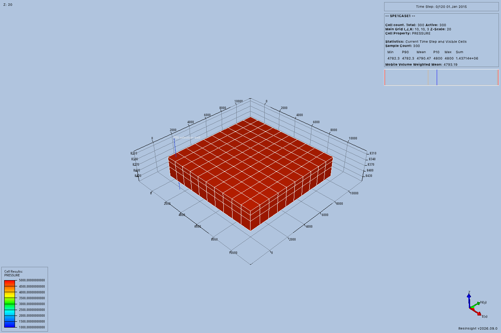
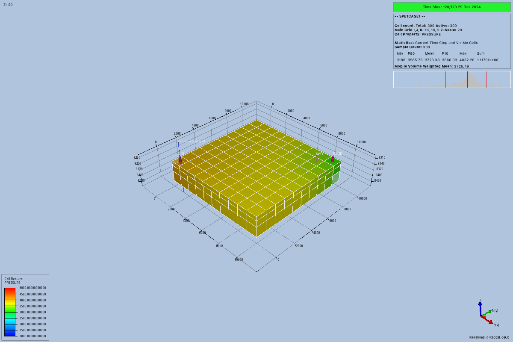

# Compare views through native images

This tutorial changes the display of an existing, trusted result.
It does not change simulator inputs or run a simulation.
The server must advertise `project_inspect`, `view_apply`, and `view_render`.
The client must deliver native image content to its model.

## Prepare the connection

The host must supply session and view services with the required native ResInsight capabilities.
The released RIPS package alone does not provide all those capabilities.
RIPS is the Python client for ResInsight remote calls.
The [developer setup](../development/views.md) describes the compatible native build and trusted result binding.

A trusted loader must already bind the loaded case to its stored result.
The host must provide the model revision, result, grid, coordinate metadata, and available report times.
These values cannot be discovered through a current MCP result-query tool.
`project_inspect` provides object references, not simulator result lineage.
A result lineage records which model and execution produced a result.

Ask your agent:

> Inspect the project and select the supplied case and two views.
> Use the trusted result context supplied by this host.
> Compare initial and final pressure with a fixed legend.

Use `session_list` to obtain the session identifier.
Call `project_inspect` with `{"session_id": "<SESSION_ID>"}`, replacing the placeholder with that identifier.
Select case and view references from its returned `objects`.
The view service checks that each selected view belongs to the selected case.
Optional well references also come from this inspection.
`selected_wells` records identities without editing wells or changing their visibility.

## Apply a complete scene

A scene version identifies one confirmed set of display settings.
Use version `0` for a view without a confirmed edit in the current service.
For later edits, use the version from that view's latest edit receipt.

Use this argument template after resolving the current references and trusted result context.
The complete example comes from the [P06 exchange](../development/evidence/p06/observer/server-responses.jsonl).
Its identifiers belong to that historical trial and must not be reused against another workspace.
The preceding `project_inspect` issued its case, view, and well references.
Trusted trial setup supplied its model, result, grid, coordinates, and report metadata.
The camera values describe that trial's native display coordinates.

```text
view_apply({"context": CURRENT_VIEW_CONTEXT, "width": 1200, "height": 800})
```

`CURRENT_VIEW_CONTEXT` means the complete current context object supplied and resolved in the preceding steps.
The [recorded full request](examples/p06-view-apply.json) shows every field from the first P06 `view_apply` call.

For your project, replace every trial identity with the corresponding current reference or trusted host value.
Choose camera values appropriate for your loaded scene.
Send the complete context, including unchanged settings, with each `view_apply` request.
The operation does not accept a partial settings patch.

A successful edit returns `outcome.value.edit` and an observation outcome.
Make sure that `outcome.value.observation.outcome.status` is `success` before interpreting an image.
The observation contains its identifier, actual context, capture time, and image metadata.
The response also contains native PNG image content.
The receipt advances the scene version once and records actual native settings.
Native camera readback can differ slightly from requested values.

## Compare six observations

The P06 trial made one project inspection, five complete view edits, and one control render.
Each image was 1200 by 800 pixels.
The [preserved answer](../development/evidence/p06/observer/answer.json) and [image review](../development/evidence/p06/observer/image-review.json) record the accepted comparison.

| Image | Operation and settings | Expected visible observation |
| --- | --- | --- |
| [1](../development/evidence/p06/observer/native-01.png) | Apply target pressure at report `0`, scene version `0`. | A red-orange full block. |
| [2](../development/evidence/p06/observer/native-02.png) | Apply the same pressure settings to the second view, scene version `0`. | The same full block establishes a control. |
| [3](../development/evidence/p06/observer/native-03.png) | Apply target pressure at report `120`, scene version `1`. | Yellow and olive cells, with greener cells near the right edge. |
| [4](../development/evidence/p06/observer/native-04.png) | Apply target `SGAS` at report `120`, scene version `2`. | A green upper layer and blue lower side layers. |
| [5](../development/evidence/p06/observer/native-05.png) | Apply the changed target camera and filter, scene version `3`. | A rotated half-block with exposed blue side layers. |
| [6](../development/evidence/p06/observer/native-06.png) | Render the second view's returned context at scene version `1`. | The initial control scene remains visibly unchanged. |


These captures compare initial and final pressure with the same legend bounds.
Open either image to inspect its full size.

| Initial pressure, report 0 | Final pressure, report 120 |
| --- | --- |
| [](../development/evidence/p06/observer/native-01.png) | [](../development/evidence/p06/observer/native-03.png) |

For image 3, the exact report and legend fragments were:

```json
{
  "report_time": {
    "index": 120,
    "elapsed_days": 3650,
    "calendar_date": "2024-12-29"
  },
  "legend": {"minimum": 1000, "maximum": 5000}
}
```

These are context fragments, not complete tool arguments.
Pressure retained the same 1,000 to 5,000 psi legend across the comparison.
The index, elapsed days, and date must all match the native case and stored report series.
Do not infer a report index from its calendar date.

For image 4, the changed property and legend fragments were:

```json
{
  "property": {"name": "SGAS", "unit": "1"},
  "legend": {"minimum": 0, "maximum": 1}
}
```

`SWAT`, `SGAS`, `SOIL`, and `PORO` use dimensionless unit `1`.
`PRESSURE` requires a stored `FIELD` revision and uses `psi`.
The native case must contain the requested property.

For image 5, the camera moved to `[23003.56868899781, 23003.56868899781, 23003.56868899781]`.
Its target, up vector, perspective projection, and 40-degree field of view retained their requested values.
The exact historical filter fragment was:

```json
{
  "filters": [{
    "grid_id": "grid_cd9b8340e79d48dd9262fb0c88d37a25",
    "minimum": {"i": 0, "j": 0, "k": 0},
    "maximum": {"i": 4, "j": 9, "k": 2},
    "include": true
  }]
}
```

Replace that historical grid identifier with the trusted current grid identifier.
Filter bounds are zero-based and inclusive on the main grid.
Multiple ranges combine with `AND`.
Image 5 retained gas saturation bounds of zero to one.
The camera uses display coordinates without providing a reservoir coordinate conversion.
Orthographic cameras instead require `parallel_scale`, which equals half the visible vertical extent.

To capture image 6, use this template:

```text
view_render({
  "session_id": "<SESSION_ID>",
  "context": CONTROL_CONTEXT,
  "width": 1200,
  "height": 800
})
```

`CONTROL_CONTEXT` is the complete actual context returned for image 2.
Replace `<SESSION_ID>` with its session identifier.
Do not use the target view's latest context for the control view.

Ask your agent:

> Describe the visible pressure and saturation changes using the returned images.
> Explain the filter's visible effect and whether the control view changed.

These observations support visible comparisons of one existing result.
They do not establish numerical accuracy or a clone-comparison workflow.
The six images do not establish native editor usability.
Native editor inspection remains deferred to [issue #34](https://github.com/LukasMosser/resinsight-mcp/issues/34).

## Retrieve or recover an observation

To retrieve a saved observation, use this template:

```text
observation_get({
  "session_id": "<SESSION_ID>",
  "observation_id": "<OBSERVATION_ID>"
})
```

Take both identifiers from the successful observation response.
This operation does not render a new frame.
With the view service configured, the saved observation's native scene must still be current.
Retain earlier returned images in the conversation for historical comparisons.
Do not claim that an earlier image proves the current scene.

An optional `expected_observation_id` in `view_apply` requires that observation's scene to remain current.
If only the scene changed, apply complete settings with current references and the latest confirmed scene version.
If the project or connection changed, inspect again and have the trusted loader restore the result binding.
Use version `0` for the newly referenced view.

If capture fails after a confirmed edit, preserve the successful receipt.
Do not repeat the edit merely to recover its image.
Use `view_render` with the receipt's context when that scene remains current.
A failed capture never substitutes an earlier PNG.
An uncertain edit requires current-state inspection before further changes.
The [view guide](../views.md) describes stale scenes, missing capabilities, and other failure outcomes.
